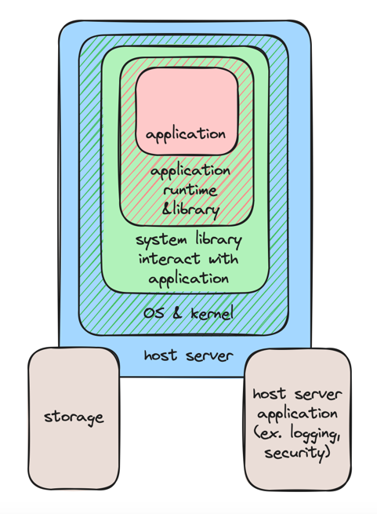
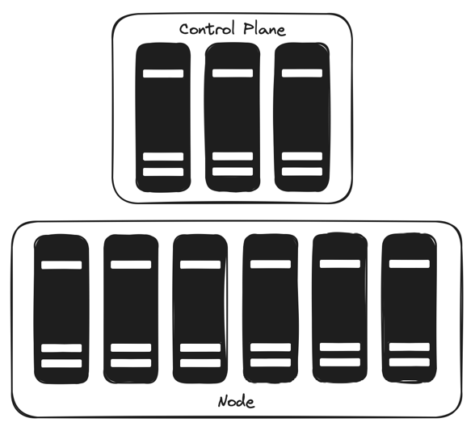
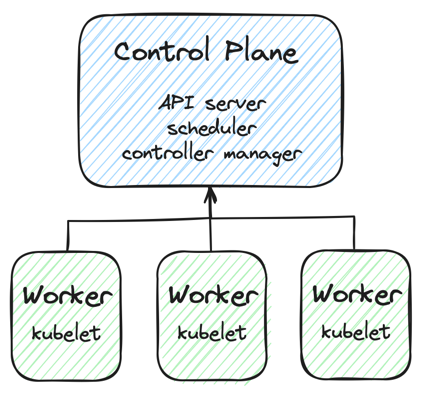

## 1장. 왜 쿠버네티스인가?
> - 쿠버네티스가 존재하는 이유
>   - 쿠버네티스는 인프라를 편하게 관리할 수 있게 함
>   - 쿠버네티스 플랫폼은 모든 유형의 인프라에서 실행할 수 있음
>   - 함께 작동하는 컴포넌트 생태계를 구축함. 컴포넌트를 결합하여 긴급한 변경이 필요할 때 실시간으로 예방, 복구, 확장 가능
>   - configuration-driven, container-driven 방식
> - 일반적으로 사용되는 쿠버네티스 용어
>   - 파드: 쿠버네티스의 기본 빌딩 블록. 확장, 장애 처리, DNS 조회, RBAC 보안 규칙 등의 기능을 제공함
> - 구체적인 쿠버네티스 유스케이스
> - 고수준 쿠버네티스 기능
>   - 쿠버네티스는 하나 이상의 컴퓨터에서 클러스터를 생성함. 클러스터는 컨테이너를 배포하고 호스트할 수 있는 플랫폼을 제공함
>   - 쿠버네티스는 컨테이너 오케스트레이션, 스토리지 관리, 분산 네트워킹을 제공
>   - 쿠버네티스 API 서버를 대상으로 API를 호출하면 쿠버네티스 애플리케이션을 관리할 수 있음
> - 쿠버네티스를 실행하지 않는 경우

- 쿠버네티스(Kubernetes): 컨테이너 호스팅을 위한 오픈소스 플랫폼

### 1.1. 사전 준비 - 몇 가지 핵심 용어 검토하기

- CNI와 CSI: 컨테이너 네트워킹 및 스토리지 인터페이스
  - 쿠버네티스에서 실행되는 파드(컨테이너)에 대한 플러그형 네트워킹과 스토리지를 가능하게 함
- 컨테이너(Container): 도커 및 OCI 이미지
  - 일반적으로 애플리케이션을 실행함
- Control Plane: 쿠버네티스 클러스터의 두뇌
  - 컨테이너의 스케줄링과 모든 쿠버네티스 객체의 관리가 이루어짐(마스터)
- DemonSet: Deployment와 유사하나, 클러스터의 모든 노드에서 실행됨
- Deployment: 쿠버네티스에서 관리되는 파드의 모음
- `kubectl`: 쿠버네티스 컨트롤 플레인과 통신하기 위한 명령행 도구
- `kubelet`: 클러스터 노드에서 실행되는 쿠버네티스 에이전트
  - Control Plane이 동작하는 데 필요한 작업 수행
- 노드(Node): `kubelet` 프로세스가 실행되는 머신
- OCI: 실행 가능한 독립형 애플리케이션을 만들기 위한 일반적인 이미지 형식(도커 이미지)
- 파드(Pod): 실행 중인 컨테이너를 캡슐화하는 쿠버네티스 객체

### 1.2. 인프라 드리프트 문제와 쿠버네티스

- 인프라 드리프트 문제(패치가 누락되거나 적용되지 않거나 부적절하게 적용되어 일부 시스템이 다른 시스템과 약간 다르게 동작함)의 요인
  - 여러 서버에서 자바 버전 업데이트
  - 특정 애플리케이션이 특정 위치에서 실행되지 않도록 함
  - 오래되거나 고장 난 하드위어의 교체나 확장, 그리고 해당 하드웨어에서의 애플리케이션 마이그레이션
  - 로드밸런싱 경로의 수동 관리
  - 공통의 강제적인 구성 언어가 없는 경우 새로운 인프라 변경에 대한 문서화 잊음
- 쿠버네티스 이전에 인프라 드리프트 문제를 해결하는 방법: `Puppet`, `Chef`, `Mesos`, `Ansible`, `SaltStack`
- 쿠버네티스로 인프라 드리프트 문제를 해결할 수 있음
  - [`kubectl`](https://kubernetes.io/docs/tasks/tools/)(쿠버네티스 서버에 REST API를 호출하는 명령행 클라이언트)로 애플리케이션을 중앙에서 관리할 수 있음
  - `Ansible`, `SaltStack`, `Terraform` 처럼 방화벽이나 바이너리 설치 같은 운영체제 특화 요구사항을 포함하는 인프라 구성
  - 리눅스 환경에서 권한을 갖는 컨테이너(privilaged container)를 사용함(윈도우 v1.22에서 HostProcess 파드)
    - 리눅스 시스템에서 권한을 갖는 컨테이너는 트래픽을 애플리케이션으로 라우팅하기 위한 `iptables` 규칙을 관리할 수 있음(kube-proxy)
  - 모든 클라우드나 서버, 데이터 센터 환경에서 컨테이너 오케스트레이션 실행을 위한 현대적 표준

### 1.3. 컨테이너와 이미지

- 도커: 컨테이너를 실행하는 방법
- 컨테이너: 실행 중인 [OCI 이미지](https://github.com/opencontainers/image-spec)
  - 격리 계층(layer of isolation): 서버에서 라이브러리를 관리하거나 다른 우발적인 애플리케이션 의존성을 갖는 인프라를 미리 로드할 필요 없음

    

    - 각 애플리케이션은 실행 중인 컨테이너 내부에 격리됨
      - 서로 다른 버전의 라이브러리가 필요한 두 개의 애플리케이션을 두 개의 컨테이너에 실행 가능
- OCI 명세: 도커와 같이 프로그램에서 실행할 수 있는 이미지를 정의하는 표준 방법(다양한 계층을 갖는 tarball)
  - tarball: 리눅스 바이너리, 애플리케이션 파일 등 포함
  - 컨테이너를 실행할 때 컨테이너 런타임(도커, `containerd`, CRI-O 등)은 이미지를 가져와 압축을 풀고 이미지 콘텐츠를 실행하는 프로세스를 시작함
  - 이미지와 쿠버네티스로 불변 서버(immutable server)를 실행할 수 있음
    - 쿠버네티스로 컨테이너 자동화

### 1.4. 쿠버네티스와 핵심 기초

> 네트워크 규칙이나 역할 기반 인증 및 권한 부여(RBAC) 등을 YAML, JSON으로 정의하여 OCI 이미지 실행

- 간단한 앱에 대해 쿠버네티스를 실행하는 방법
  1. MySQL을 실행할 수 있는 이미지 생성
      ```dockerfile
      FROM alpine:3.15.4
      RUN apk add --no-cache mysql
      ENTRYPOINT ["/usr/bin/mysqld"]
      ```
  2. 이미지를 빌드(`docker build`)하고 OCI 레지스트리(런타임에 컨테이너가 이미지를 저장하고 검색하는 저장소)에 push(`docker push`)
      - [오픈소스 레지스트리](https://github.com/goharbor/harbor), [도커 레지스트리](https://hub.docker.com)
  3. MySQL의 클라이언트 역할을 하는 `python` 애플리케이션 이미지 생성
      ```dockerfile
      FROM python:3.7
      WORKDIR /myapp
      COPY src/requirements.txt ./
      RUN pip install -r requirements.txt
      COPY src /myapp
      CMD [ "python", "mysql-custom-client.py" ]
      ```
  4. 이미지 빌드 & OCI 레지스트리 push
  5. 클라이언트와 MySQL 서버를 실행할 파드 생성 `my-app.yaml`
      ```yaml
      apiVersion: v1
      kind: Pod
      metadata:
        name: core-k8s
        spec:
        containers:
          - name: my-sql-server
            image: myregistry.com/mysql-server:v1.0
      ---
      apiVersion: v1
      kind: Pod
      metadata:
        name: core-k8s-mysql
        spec:
        containers:
          - name: my-sqlclient
            image: myregistry.com/mysql-custom-client:v1.0
            command: ['tail', '-f', '/dev/null']
      ```
  6. 쿠버네티스 클라이언트 도구로 실행(`kubectl create -f my-app.yaml`)
     - 쿠버네티스 API 서버에 연결하고 저장되어야 하는 YAML 전송
     - 쿠버네티스가 API 서버에 있는 두 개의 파드 YAML을 가져와 어디서 실행 중인지 확인
       - 궁극적으로 일관된 시스템이어야 함
         - 클러스터 내의 노드가 계속해서 발생하는 이벤트에 응답하고 API 서버에 통신하는 `kubelet`을 통해 해당 노드의 객체 상태를 업데이트해야 함
         - OCI 이미지가 존재하고 쿠버네티스 클러스터에서 해당 노드에 액세스할 수 있어야 함
- (궁극적) 일관성 모델
  - 클러스터에 있는 모든 애플리케이션의 전체 상태에 대한 변경을 지속적으로 요청할 수 있음을 보장함
  - 기본적인 쿠버네티스 플랫폼이 앱의 동작 방법에 대한 실행 계획 파악 가능
- 쿠버네티스에 세부 사항 구현을 위임
  - (쿠버네티스를 재설치하지 않는 이상) 일회성의 Ansible, Puppet 등을 업데이트하지 않아도 됨
  - 클러스터 API 같은 도구로 더 편리하게 할 수 잇음

#### 1.4.1. 쿠버네티스에서 모든 인프라 규칙은 평범한 YAML로 관리된다

- 쿠버네티스 API를 사용해 YAML, JSON으로 인프라 자동화
  - 전통적인 인프라 규칙 정의
    - 포트나 IP 경로의 서버 구성
    - 애플리케이션을 위한 영구 스토리지 가용성
    - 특정 서버나 임의의 서버에 대한 소프트웨어 호스팅
    - 애플리케이션이 서로 액세스하기 위한 RBAC나 네트워크 규칙 같은 보안 프로비저닝
    - 애플리케이션별 또는 글로벌 기반의 DNS 구성
  - 쿠버네티스가 변경사항을 적용, 모니터링, 실패나 종단 해결함
    - 많은 시나리오를 쿠버네티스가 자동으로 처리함

### 1.5. 쿠버네티스의 기능

- 컨테이너 오케스트레이션 플랫폼: 인스턴스 실행 과정, 호스트 프로비저닝, 컨테이너 연결 등 자동화
  - 오케스트레이션 절차 최적화. 애플리케이션 수명주기 연장
  - 핵심 기능
    - API 서버 내부의 모든 기능에 대한 클라우드 중립적인 API 노출
    - 쿠버네티스 컨트롤러 매니저(KCM)에서 모든 주요 클라우드 및 하이퍼바이저 플랫폼과 통합
    - 모든 서비스, 애플리케이션, 데이터 센터 구성, 쿠버네티스 지원 인프라 상태 저장하고 정의하기 위한 내결함성(fault-tolerant) 프레임워크 제공
    - 개별적인 호스트, 서비스, 애플리케이션에 관계없이 사용자가 마주하는 다운타임을 최소화하는 배포 관리
    - 롤링 업데이트(rolling update) 인식을 통해 호스트와 호스팅된 애플리케이션에 대한 스케일링 자동화
    - 로드 밸런싱을 사용해 내부 및 외부 통합(ClusterIP, NodePort, LoadBalancer 서비스 타입) 생성
    - 노드 레이블링 및 쿠버네티스 스케줄러를 통해 메타 데이터에 기반한 특정 가상화 하드웨어에서 실행되도록 애플리케이션을 할당하는 기능 제공
    - DemonSet을 통한 고가용성 플랫폼과 클러스터의 모든 노드에서 실행되는 컨테이너의 우선순위를 지정하는 기술 인프라 제공
    - 이전에 KubeDNS에 의해 구현되었으며, 최근에는 API 서버와 통합된 CoreDNS에 의해 구현된 DNS를 통한 서비스 검색 허용
    - 영구적인 애플리케이션을 실행하는 것과 같은 방법으로 저장소 및 컨테이너를 사용하는 배치 프로세스(Job) 실행
    - API 확장을 포함하고, 포트 매핑이나 연결 없이 사용자 정의 리소스 정의를 사용해 네이티브 API 기반 프로그램 구성
    - `kubectl exec` 및 `kubectl describe`를 통해 언제든지 모든 컨테이너에 대한 원격 실행을 포함한 클러스터 전반의 실패한 프로세스에 대한 검사 활성화
    - StorageClass API와 PersistentVolumes를 통한 컨테이너에 대한 로컬/원격 스토리지 마운트와 선언적 스토리지 볼륨 관리 허용
- 쿠버네티스는 같은 클러스터나 클러스터 내에서 실행되는 다양한 애플리케이션의 수명주기 관리 표준화함

  

- 클러스터에서의 실패 시나리오
  1. 노드가 Control Plane에 대한 응답 멈춤
  2. Control Plane이 응답하지 않는 노드에서 실행 중인 파드를 다른 노드에 다시 할당함
  3. 사용자가 `kubectl`을 통해 API 서버로 API를 호출하면 API는 응답하지 않는 노드와 파드의 새로운 위치에 대한 올바른 정보를 응답함
  4. 파드의 서비스와 통신하는 모든 클라이언트는 파드의 새로운 위치로 라우팅함
  5. 기존 데이터를 계속 읽을 수 있게 오류가 발생한 파드에 연결된 스토리지 볼륨은 새로운 파드 위치로 이동함
- 쿠버네티스를 불변 OS에서 실행하는 경우, 기본 OS를 사용해 노드/쿠버네티스 설치함
  - 기본 OS는 전체 OS를 업데이트할 때만 업데이트(불변)
  - 클라우드, 라즈베리 파이 등에서 쿠버네티스를 실행할 수 있음
- 쿠버네티스 네이티브 생태계
  - 모범사례 식별할 수 있음
  - 문제를 방지하기 위해 사전에 변경 가능
  - 드리프트를 방지하기 위한 일관성 있는 환경을 유지할 수 있음

### 1.6. 쿠버네티스 컴포넌트와 아키텍처

- 쿠버네티스 아키텍처: 하드웨어 + 쿠버네티스 Control Plane + 쿠버네티스 워커 노드

  

  - 하드웨어 인프라(Hardware infrasturcture): 컴퓨터, 네트워크 인프라, 스토리지 인프라, 컨테이너 레지스트리
  - 쿠버네티스 워커 노드(Kubernetes worker node): 쿠버네티스 클러스터의 기본 컴퓨팅 단위
  - 쿠버네티스 Control Plane(Kubernetes control plane): 쿠버네티스의 모체. API 서버, 스케줄러, 컨트롤러 관리자, 다른 컨트롤러

#### 1.6.1. 쿠버네티스 API

- 쿠버네티스 API 객체: 쿠버네티스 플랫폼에서 마이크로서비스와 기타 컨테이너 타입의 소프트웨어 애플리케이션을 관리하기 위해 필요함
    ```text
    - 명명된 API 버전(ex. v1 or rbac.authorization.k8s.io/v1)
    - 종류(ex. kind: Deployment)
    - 메타데이터 섹션
    ```
  - `kube-apiserver`: 쿠버네티스 API 서버
    - `kubectl`에 요청할 수 있는 것은 대부분 API 서버에 저장되고 버전이 지정된 객체를 읽고 쓸 수 있음
      - 예외: 실행 중인 파드의 로그를 가져옴
    - 모든 객체에 대한 CRUD 작업 수행. RESTful 인터페이스 제공
    - `kubectl describe`: 다양한 객체에 대한 복합적인 뷰
    - API 요소
      - 런타임 파드(Runtime Pod)의 배포
      - API 구현 세부사항
      - 인그레스 서비스(Ingress Services)와 로드 밸런싱
      - PersistentVolumes 및 PersistentVolumeClaims 스토리지
      - NetworkPolices와 네트워크 보안
    - 쿠버네티스의 API 타입
      ```script
      $ kubectl api-resources | head
      NAME                    SHORTNAMES  NAMESPACED  KIND
      bindings                            true        Binding
      componentstatuses       cs          false       ComponentStatus
      configmaps              cm          true        ConfigMap
      endpoints               ep          true        Endpoints
      events                  ev          true        Event
      limitranges             limits      true        LimitRange
      namespaces              ns          false       Namespace
      nodes                   no          false       Node
      persistentvolumeclaims  pvc         true        PersistentVolumeClaim
      ```
      - 네임스페이스(Namespace): 임의의 객체가 특정 네임스페이스 내부에 존재함
        - ex. 10개의 마이크로서비스로 이루어진 애플리케이션: 같은 네임스페이스 내에 파드, 서비스, PersistentVolumeClaims(PVC)를 만들 수 있음
        - 네임스페이스로 앱과 관련된 쿠버네티스 API 객체를 분리함
  - `etcd`: API 서버의 데이터스토어

#### 1.6.2. 예제 1: 온라인 소매업체

> 휴가 기간 같은 계절적 수요에 따라 빠르게 확장할 수 있어야 하는 주요 온라인 소매업체 
> 
> 문제: 확장, 확장 방법 예측

- 쿠버네티스는 가용성이 높고 확장 가능한 분산 시스템을 실행할 때 발생할 수 있는 문제를 해결할 수 있음
  - 쉽게 확장 및 배포하고 고가용성 시스템을 만들 수 있음

#### 1.6.3. 예제 2: 온라인 기부 솔루션

> 사용자가 기부할 수 있는 광범위한 자선단체를 선택할 수 있는 온라인 기부 웹사이트(워드프레스 사이트로 시작)
> 
> 요구사항: 머신러닝, 광고 기능, 메시징, `Python`, `Lua`, `NGINX`, `PHP`, `MySQL`, `Cassandra`, `Redis`, `Elastic`, `ActiveMQ`, `Spark` 등
> 
> 문제: 비즈니스 트랜잭션의 의존성(사용자 정의 UX, 중간 계층, 데이터베이스 계층을 갖는 JVM 프레임워크)

- 초기 인프라: `Perpet`으로 모든 설정을 하는 수동으로 구축된 클라우드 VM
  - 한두 개의 애플리케이션만 호스팅하는 VM이 많아짐
- 쿠버네티스로 전환: `Perpet`과 서버 설정을 완전히 제거함. 수동으로 컴퓨터 인프라를 관리할 필요 없음
  - VM 수 감소: 30 -> 5
  - 복잡한 서비스 게시를 위한 DNS 부담 해결
  - 치명적인 실패 시 복구 시간 예측 가능

### 1.7. 쿠버네티스를 사용하지 말아야하는 경우

- 고성능 컴퓨팅(HPC): 컨테이너를 사용하면 더 복잡해지고 새로운 계층에서 성능이 저하됨
  - 컨테이너를 사용하면 지연시간은 훨씬 더 적어지나, 애플리케이션이 나노초(ns), 마이크로초(ms)에 영향을 받는 경우 좋지 않을 수 있음
- 레거시(Legace): 컨테이너화를 어렵게 하는 하드웨어, 소프트웨어, 대기시간 요구사항이 있을 수 있음
  - 컨테이너에서 실행하거나 쿠버네티스 클러스터에서의 실행을 공식적으로 지원하지 않는 소프트웨어를 사용할 수 있음
- 마이그레이션(Migration): 레거시 시스템의 구현이 너무 엄격할 경우 이점이 거의 없음
  - 모놀리식 애플리케이션을 논리적인 컴포넌트로 분석하는 경우 마이그레이션을 통해 독립적으로 확장할 수 있음
