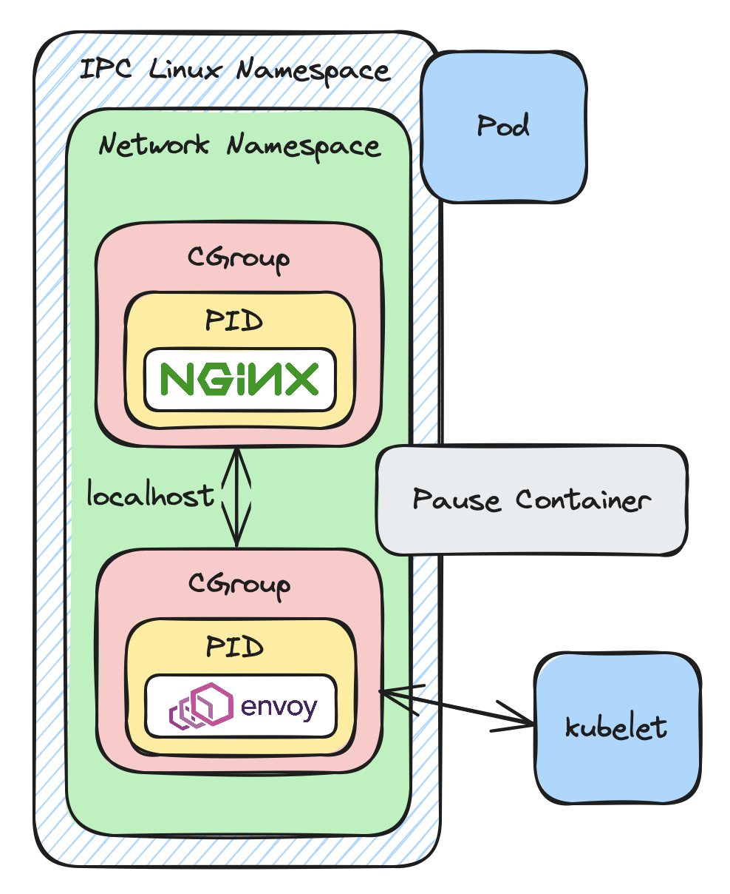

## 2. 왜 파드인가?

> - 파드
>   - 쿠버네티스 API 객체
>     - 쿠버네티스는 API 객체(Deployment, StatefulSet 등)인 다양한 패턴으로 실행할 수 있음
>   - 하나 이상의 컨테이너를 실행하기 위한 환경을 생성하기 위해 리눅스 네임스페이스를 사용함
> - 웹 앱 예제와 파드가 필요한 이유
>   - 컨트롤러: 파드의 수명주기 생성&관리하는 소프트웨어 컴포넌트
>     - `kubelet`, `CCM`, 스케줄러
> - 파드를 통한 쿠버네티스 구축 방법
>   - API 서버(`kube-apiserver` 컴포넌트)가 클러스터의 공유 상태에서 CRUD 작업을 수행하기 위해 웹 프론트엔드의 유효성을 검사하고 웹 프론트엔드를 제공함
>     - 대부분의 Control Plane은 Control Plane을 구성하는 모든 노드에서 실행되는 API 서버를 가지고 있고, API 서버를 위한 고가용성(HA) 클러스터를 제공함
> - 쿠버네티스 Control Plane
>   - 쿠버네티스는 Control Plane을 통해 프로세스에 스토리지를 바인딩하고 실행 중인 컨테이너를 생성함
>   - 컨테이너의 개수를 확장하고 컨테이너가 비정상적인 경우 컨테이너 종료, 마이그레이션, 포트에 대한 IP 경로 생성, 로드 밸런스된 엔드포인트 업데이트함
>   - 분산 애플리케이션 관리의 다른 많은 측면을 규제함



- 파드(Pod): 클러스터에 배치될 수 있는 가장 작은 단위
  - 쿠버네티스 API 내에 정의되어 있는 객체
  - 여러 컨테이너를 포함할 수 있는 객체 정의 가능
    - 하나의 노드에 하나 이상의 컨테이너 생성할 수 있게 함

### 2.1. 웹 애플리케이션 예제

> Zeus Zap 에너지 음료 회사: 소비자들이 다양한 종류의 탄산 음료를 구매할 수 있는 웹사이트
> - 계층: 사용자 인터페이스(UI), 중간 계층(다양한 마이크로서비스), 백엔드 데이터베이스
> - 메시징, 큐잉 프로토콜

- 애플리케이션 구조
  - NGINX가 서비스하는 javascript 프론트엔드
  - Django로 호스팅된 두 개의 Python 마이크로서비스 웹 컨트롤러
  - 스토리지에서 지원되는 6379 포트 CockroachDB 백엔드
- 4개의 컨테이너로 애플리케이션 실행
  
  ```bash
  $ docker run -t -i ui -p 80:80
  $ docker run -t -i microservice-a -p 8080:8080
  $ docker run -t -i microservice-b -b 8081:8081
  $ docker run -t -i cockroach:cockroach -p 6379:6379 
  ```
  - 이미지가 실행되는 호스트 시스템은 80번 포트 하나
    - 80번 포트 앞에서 로드 밸런싱을 하지 않으면 여러 개의 UI 컨테이너 복사본을 실행할 수 없음
  - 웹 앱에 IP 주소를 수정해서 주입하거나 CockroachDB가 이동할 때 동적으로 업데이트되는 DNS 서버를 추가하지 않으면 CockroachDB 컨테이너를 다른 서버로 마이그레이션할 수 없음
  - 고가용성을 위해 각 CockroachDB 인스턴스를 별도 서버에서 실행해야 함
  - 한 서버에서 CockroachDB 인스턴스가 죽으면 데이터를 새로운 노드로 이동하고 사용하지 않는 스토리지 공간을 회수할 수 있는 방법이 필요함
- 컨테이너 오케스트레이션 플랫폼 요구사항
  - 모두 같은 포트에 바인딩된 수백 개의 프로세스 사이의 공유 네트워킹
  - 로컬 디스크가 지저분해지는 것을 방지하면서 바이너리부터 스토리지 볼륨 마이그레이션&분리
  - 비용을 절감하기 위해 사용 가능한 CPU와 메모리 리소스 활용 최적화
- noisy neighbor 현상: 멀티 테넌트 환경에서 공유 공간이나 자원을 독점하는 프로세스
  - 한 서버에서 많은 프로세스를 실행하면 부족한 리소스(CPU, 메모리)에 대한 경쟁으로 이어짐
- 대규모로 실행되는 컨테이너화된 애플리케이션 주의사항
  - 스토리지 인식 스케줄링: 데이터를 함께 사용할 수 있게 프로세스 스케줄링
  - 서비스 인식 네트워크 로드 밸런싱: 컨테이너가 한 머신에서 다른 머신으로 이동할 때 다른 IP 주소로 트래픽 전송

#### 2.1.1. 웹 애플리케이션 인프라
- 쿠버네티스 같은 컨테이너 오케스트레이션 소프트웨어가 없는 경우
  - 다음과 같은 서버 워크로드 사항이 있을 수 있음
    - 배포 플랫폼으로서의 VM이나 물리 서버
    - 로드 밸런싱
    - 애플리케이션 발견
    - 스토리지
    - 보안 시스템
  - 데브옵스 직원이 시스템을 유지하기 위해 해야하는 것
    - 중앙집중식 로깅
    - 모니터링, 경고, 메트릭
    - CI/CD 시스템
    - 백업
    - 시크릿 관리
- 쿠버네티스는 로그 순환, 상세 검사(inspection) 및 관리 도구를 기본으로 제공

#### 2.1.2. 운영 요구사항

> 사용자 트래픽 패턴: burst traffic
> - 많은 트래픽을 유발하는 특정 이벤트
> - 해당 이벤트의 다운타임에 대한 비용이 큼

- 확장성
- 고가용성
- 롤백을 허용하는 버전 관리 애플리케이션
- 비용 관리

### 2.2. 파드란 무엇인가?

- 파드(Pod): 쿠버네티스 클러스터 노드에서 컨테이너로 실행되는 하나 이상의 OCI 이미지
  - 쿠버네티스 노드(node): kubelet을 실행하는 단일 컴퓨팅 파워(서버)
    - API 객체
- 파드 실행
  ```bash
  $ cat << EOF > pod.yaml
  apiVersion: v1    # API 버전 ID = API 서버 버전
  kind: Pod         # API 서버에 대한 API 객체(ex. Pod)의 타입 선언
  metadata:
  spec:
      container:
          - name: busybox
            image: mycontainerregistry.io/foo    # 레지스트리 내의 이미지 이름 지정
  EOF
  
  $ kubectl create -f pod.yaml    # kubectl 명령어
  ```

- `kubectl`: 쿠버네티스 API와 함께 동작하는 명령행 인터페이스를 제공하는 바이너리
- `Deployment`: 쿠버네티스 클러스터에서 가장 일반적으로 사용되는 API 객체
  - 전형적인 API 객체로 마이크로서비스로 배포
- `Job`: 일괄 처리 프로세스로 파드 실행
- `StatefulSet`: 특정 요구사항을 필요로 하는 호스트 애플리케이션
  - 데이터베이스 같은 상태 저장 애플리케이션일 경우가 많음
  - 기능
    - 고유한 네트워크 식별자를 얻기 위한 Oridinal 파드 이름 지정
    - 항상 같은 파드에 마운트되는 영구적인 스토리지
    - 순서에 따르는 시작, 확장, 업데이트
- `DaemonSet`: 클러스터의 모든 노드에서 '에이전트'로 단일 파드를 실행하려는 경우 사용
  - 일반적으로 네트워킹, 스토리지, 로깅을 포함하는 시스템 서비스에 사용
- `kubectl get po`: 기본 네임스페이스에서 실행 중인 파드를 볼 수 있음

#### 2.2.1. 다양한 리눅스 네임스페이스

- 리눅스 네임스페이스: 커널 내부에서 프로세스 분리를 허용하는 리눅스 커널 기능
  - 쿠버네티스 네임스페이스와 다름
  - 리눅스 커널 파일시스템의 컴포넌트로서 이미지를 가져와 실행 중인 컨테이너를 생성하는 기본 기능 제공
- 파드: 특정 구성 내부에 있는 네임스페이스의 묶음
  - 하나 이상의 PID 네임스페이스
  - 단일 네트워킹 네임스페이스
  - IPC 네임스페이스
  - `cgroup`(control group) 네임스페이스
  - `mnt`(mount) 네임스페이스
  - `user`(user ID) 네임스페이스
- 네트워킹 네임스페이스
  - 쿠버네티스 클러스터를 포괄하는 SDN(소프트웨어 정의 네트워킹) 시스템에 연결되는 가상 네트워킹 스택
    - SDN: 로드 밸런싱을 지원하는 네트워킹 프레임워크

#### 2.2.2. 쿠버네티스, 인프라, 파드

- 노드 요구사항
  - 서버
  - 다양한 리눅스 및 윈도우 지원 요구사항을 갖는 운영체제
  - `systemd`(리눅스 시스템 및 서비스 관리자)
  - `kubelet`(노드 에이전트)
  - 컨테이너 런타임(ex. 도커 엔진)
  - 쿠버네티스 서비스를 처리하는 네트워크 프록시(kube-proxy)
  - CIN(컨테이너 네트워크 인터페이스) 공급자
- `kubelet`: 에이전트로 실행되는 바이너리 프로그램. 다양한 제어 루프를 통해 쿠버네티스 API 서버와 통신
  - `kubelet` 호스트에 예약된 모든 파드는 어떤 파드가 어떤 노드에 예약되었는지 감시하는 제어 루프를 통해 실행됨
  - 쿠버네티스 1.17 이상에서 API 서버는 heartbeat를 통해 `kubelet`이 정상인 것을 계속해서 인식함(`kube-node-lease`)
  - 임시 스토리지나 네트워크 디바이스를 포함하는 파드에 대해 필요에 따라 garbage가 수집됨
- 서비스(Service): 쿠버네티스가 정의한 API 객체
  - ClusterIP: 쿠버네티스 파드의 로드 밸런싱을 하는 내부 서비스
  - NodePort: 다양한 파드의 로드 밸런싱을 하는 쿠버네티스 노드의 개방형 포트
  - LoadBalancer: 클러스터 외부에 로드 밸런서를 생성하는 외부 서비스

#### 2.2.3. 노드 API 객체

- `kubectl get no`: `kubectl get nodes`. 쿠버네티스 클러스터의 노드 객체를 검색함
  
  ```bash
  NAME                STATUS    ROLES   AGE  VERSION
  kind-control-plane  NotReady  master  25s. v1.17.0
  ```

- 쿠버네티스 Control Plane 호스팅하는 노드 API 객체
  
  ```bash
  $ kubectl get no-kind-control-plane -o yaml
  apiVers    ion: v1
  kind: Node
  metadata:
      annotations:
          kubeadm.alpha.kubernetes.io/cri-socket:
              /run/containerd/containerd.sock
          node.alpha.kubernetes.io/ttl: "0"
          volumes.kubernetes.io/controller-managed-attached-detach: "true"
      creationTimestamp: "2020-09029T14:51:572"
      labels:
          beta.kubernetes.io/arch: amd64
          beta.kubernetes.io/os: linux
          kubernetes.io/arch: amd64
          kubernetes.io/hostname: kind-control-plane
          kubernetes.io/os: linux
          node-role.kubernetes.io/master: ""
      name: kind-control-plane
      resourceVersion: "1297"
      selfLink: /api/v1/nodes/kind-control-plane
      uid: 1636e5e1-584c-4823-9e6b-66ab5f390592
  spec:
      podCIDR: 10.244.0.0/24
      podCIDRs:
      - 10.244.0.0/24
  # 상태 섹션: 노드, 노드 구성 정보
  status:
      addresses:
          - address: 172.17.0.2
            type: InternalIP
          - address: kind-control-pane
            type: Hostname
      allocatable:
            cpu: "2"
            ephermeral-storage: 61255492Ki
            hugepages-1Gi: "0"
            hugepages-2Mi: "0"
            memory: 2039264Ki
            pods: "110"
      conditions:
          - lastHearbeatTime: "2020-09-20T14:57:28Z"
            lastTransitionTime: "2020-09-20T14:51:51Z"
            message: kubelet has sufficient memory available
            reason: KubeletHasSufficientMemory
            status: "False"
            type: MemoryPressure
          - lastHearbeatTime: "2020-09-20T14:57:28Z"
            lastTransitionTime: "2020-09-20T14:51:51Z"
            message: kubelet has no disk pressure
            reason: KubeletHasNoDiskPressure
            status: "False"
            type: DiskPressure
          - lastHearbeatTime: "2020-09-20T14:57:28Z"
            lastTransitionTime: "2020-09-20T14:51:51Z"
            message: kubelet has sufficient PID available
            reason: KubeletHasSufficientPID
            status: "False"
            type: PIDPressure
          - lastHearbeatTime: "2020-09-20T14:57:28Z"
            lastTransitionTime: "2020-09-20T14:51:51Z"
            message: kubelet has posting ready status
            reason: KubeletReady
            status: "True"
            type: Ready
      daemonEndpoints:
            kubeletEndpoint:
              Port: 10250
  # 노드에 실행되는 모든 이미지
  images:
      - names:
          - k8s.gcr.io/etcd:4.5.4-0
          sizeBytes: 289997247
      - names:
          - k8s.gcr.io/kube-apiserver:v1.17.0
          sizeBytes: 144347953
      - names:
          - k8s.gcr.io/kube-proxy:v1.17.0
          sizeBytes: 132100734
      - names:
          - k8s.gcr.io/kube-controller-manager:v1.17.0
          sizeBytes: 131180355
      - names:
          - docker.io/kindnest/kindnetd:0.5.4
          sizeBytes: 113207016
      - names:
          - k8s.gcr.io/kube-scheduler:v1.17.0
          sizeBytes: 111937841
      - names:
          - k8s.gcr.io/debian-base:v2.0.0
          sizeBytes: 53884301
      - names:
          - k8s.gcr.io/coredns:1.6.5
          sizeBytes: 41705951
      - names:
          - docker.io/rancher/local-path/provisioner:v0.0.11
          sizeBytes: 36513375
      - names:
          - k8s.gcr.io/pause:3.1
          sizeBytes: 746479
  # 쿠버네티스 시스템에 대한 버전 관리
  nodeInfo:
      architecture: amd64
      bootId: 0c700452-c292-4190-942c-55509dc43a55
      containerRuntimeVersion: containerd://1.3.2
      kernelVersion: 4.19.76-linuxkit
      kubeProxyVersion: v1.17.0
      kubeletVersion: v1.17.0
      machineID: 27e279849eb94684ae8c173287862c26
      operatingSystem:linus
      osImage: Ubuntu 19.10
      systemUUID: 9f5682fb-6de0-4f24-b513-2cd7e6204b0a
  ```

- 파드가 이미지를 배포하는 도구 제공
  - 노드에 이미지 배포
    - `kubelet`에 의해 수명주기 관리됨
  - 서비스 객체: 쿠버네티스 네트워크 프락시에 의해 관리됨
    - DNS 시스템(ex. CoreDNS): 애플리케이션 조회 기능 제공
      - 한 파드의 마이크로서비스가 또 다른 파드에서 실행 중인 CockroachDB와 통신 가능
    - 쿠버네티스 네트워크 프락시
      - 내부 로드 밸런싱 기능, 장애 처리, 업그레이드, 가용성 및 확장 지원
  - 영구 스토리지: `mnt` 리눅스 네임스페이스, `kubelet`, 노드로 파드에 드라이브 마운트
    - `kubelet`이 파드를 생성할 때 스토리지가 파드에 마운트 됨

#### 2.2.4. 웹 애플리케이션과 Control Plane

- 고가용성(HA): 서비스 수준 계약(SLA)의 요구사항 충족시키는 것
  - 9의 개수: 얼마나 많은 다운타임이 발생할 수 있는지
    - ex. $99.99\%$: 일년에 52분 36초 다운타임
    - ex. $99.999\%$: 일년에 5분 15초 다운타임
- 확장
- 비용 절감
- 컨테이너 버전 관리
- 사용자와 애플리케이션의 보안

### 2.3. kubectl로 웹 애플리케이션 생성하기

- `kubectl apply`: `kubectl`이 Control Plane의 첫 번째 컴포넌트인 API 서버와 통신함
  
  ```bash
  $ kubectl apply -f deployment.yaml
  apiVersion: apps/v1
  kind: Deployment
  metadata:
      name: nginx
  spec:
      replicas: 3
  selector:
      matchLabels:
          app: nginx
  template:
      metadata:
          labels:
              app: nginx
      spec:
          containers:
          - name: nginx
          image: nginx:1.7.9
          ports:
          - containerPort: 80
  ```

#### 2.3.1. 쿠버네티스 API 서버: kube-apiserver

- `kube-apiserver`: 쿠버네티스 API 서버. 쿠버네티스 클러스터를 위한 다양한 API 객체를 노출하는 HTTP 기반 REST 서버
  - API 객체: 파드, 노드, HPA(Horizontal Pod Autoscaler)
  - 클러스터의 공유 상태에서 CRUD 서비스를 수행하기 위한 웹 프론트엔드를 검증하고 제공함
  - Control Plane의 컴포넌트와 통신함
    - 노드가 시작되면 `kubelet`은 API 서버와 통신을 통해 노드가 클러스터에 등록됐는지 확인함(모니터링)
    - 쿠버네티스 데이터베이스인 `etcd`와 통신하는 Control Plane의 유일한 컴포넌트
  - 승인 컨트롤러: 인증, 권한 부여 기능 제공

#### 2.3.2. 쿠버네티스 스케줄러: kube-scheduler

- `kube-scheduler`: 쿠버네티스 스케줄러.
  - 파드 스케줄링 고려 사항
    - 노드의 하드웨어 구성요소
    - 이용 가능한 CPU와 메모리 리소스
    - 정책적인 스케줄링 제약사항
    - 다른 가중치 요소
  - 파드 선호도, 반선호도 규칙(파드 스케줄링, 배치 동작 지정)을 따름
    - 파드 선호도 규칙: 규칙과 일치하는 노드에 파드를 끌어들임
    - 파드 반선호도 규칙: 노드에서 파드 제거
    - Taint: 노드가 파드의 세트에 접근하지 못하게 함
      - 스케줄러가 어떤 파드에 어떤 노드에 존재하지 않아야 하는가 결정할 수 있음
- `kubelet`: 노드의 미니 스케줄러처럼 동작. 파드의 수명주기 제어
  - 쿠버네티스 스케줄러가 `NodeName`으로 파드를 업데이트하면 `kubelet`이 해당 파드를 노드에 배치함
  - Control Plane은 컴포넌트를 실행하지 않는 노드와 완전히 분리
    - Control Plane이 중단되어도 애플리케이션의 정보를 잃지 않음

#### 2.3.3. 인프라 컨트롤러

- CockroachDB: 클라우드 네이티브 환경에서 실행되는 Postgres와 호환되는 분산 데이터베이스
- CockroachDB에 오퍼레이터 설치
  
  ```bash
  $ kubectl apply -f https://raw.githubusercontent.com/
            cockroachdb/cockroach-operator/master
            install/crds.yaml        # 오퍼레이터가 사용하는 사용자 정의 리소스 정의를 설치함
  $ kubectl apply -f https://raw.githubusercontent.com/
            cockroachdb/cockroach-operator/master
            install/operator.yaml    # 기본 네임스페이스에 오퍼레이터 설치
  ```
  
  - 사용자 정의 리소스 정의(CRD): 새로운 API 객체를 정의하는 API 객체
    - 사용자가 리소스를 정의하는 방식으로 CRD 생성(주로 YAML 형식)
      - CRD는 기존 쿠버네티스 클러스터에 적용되고 실제로 API가 다른 API 객체를 만들 수 있도록 함
- `example.yaml` 다운로드
  
  ```bash
  $ curl -LO https://raw.githubusercontent.com/cockroachdb/cockroach-operator/master/examples/example.yaml
  apiVersion: crdb.cockroachlabs.com/v1alpha1
  kind: CrdCluster
  metadata:
      name: cockroachdb
  spec:
      dataStore:
          pvc:
              spec:
                  accessModes:
                    - ReadWriteOnce
                  resources:
                    requests:
                      storage: "60Gi"
                  volumeMode: Filesystem
      resources:
          requests:
              cpu: "2"
              memory: "8Gi"
          limits:
              cpu: "2"
              memory: "8Gi"
      tlsEnabled: true
      image
          name: cockroachdb/cockroach:v21.1.5
      nodes: 3
      additionalLabels:
          crdb: is-cool
  ```
  
  - 오퍼레이터 패턴으로 다음의 리소스 생성 및 관리
    - 데이터베이스에 대한 시크릿이 저장된 전송 계층 보안(TLS) 키
    - PersistentVolume과 PersistentVolumeClaim 스토리지를 포함해 CockroachDB를 수용하는 StatefulSet
    - 서비스
    - 파드 중단 예산(PodDisruptionBudget, PDB)
  - PV(PersistentVolume), PVC(PersistentVolumeClaim): 스토리지 정의를 생성하고 KCM(`kube-controller-manager`), CCM(클라우드 컨트롤러 관리자)에 의해 활성화됨
    - KCM: Control Plane에 있는 노드에서 컨트롤러라고 하는 다양한 컴포넌트를 실행하는 제어 루프 세트
    - CCM: 클라우드 공급자가 기본 쿠버네티스 깃허브 저장소의 외부에서 개발과 유지보수를 할 수 있게 하는 인터페이스 생성
- 클라우드 특화 컨트롤러: CCM이 호출의 대부분 실행
  - 노드 컨트롤러: KCM과 동일한 코드 실행
  - 라우트 컨트롤러: 기본 클라우드 인프라에서 경로 설정
  - 서비스 컨트롤러: 클라우드 공급자 로드 밸런서 생성, 업데이트, 삭제
  - 볼륨 컨트롤러: 볼륨 생성, 연결, 마운트. 볼륨을 오케스트레이션하기 위해 클라우드 공급자와 상호작용
- 클라우드 컨트롤러는 다음의 클라우드 공급자 인터페이스에 대해 동작
  - 컨테이너 네트워킹 인터페이스(CNI): 파드에 IP 주소 제공
  - 컨테이너 런타임 인터페이스(CRI): 다양한 컨테이너 실행 엔진을 정의하고 연결
  - 컨테이너 스토리지 인터페이스(CSI): 벤더가 쿠버네티스의 기반코드를 수정할 필요 없이 새로운 스토리지 타입을 지원하는 모듈식 기법
- ClusterIP 서비스 대신 LocadBalncer 서비스 생성: 쿠버네티스 클라우스 공급자가 사용자 로드 밸런서의 요청을 감시하여 로드 밸런싱 수행
  
  ```bash
  apiVersion: v1
  kind: Service
  metadata:
      name: example-service
  spec:
      selector:
          app: example
          ports:
              - port: 8765
                targetPort:9376
          type: LoadBalancer
  ```
  
  - KCM 감시 루프: 새로운 로드 밸런서가 필요하다는 사실을 감지하고 클라우드에서 로드 밸런서 생성에 필요한 API를 호출하거나 쿠버네티스 클러스터 외부 하드웨어 로드 밸런서를 호출함
    - API 호출 내에서 기본 인프라는 어떤 노드가 클러스터의 일부인지 파악 후 트래픽을 해당 노드로 라우팅
    - 호출이 노드에 도달하면 CNI 공급자가 제공하는 소프트웨어 정의 네트워크가 트래픽을 올바른 파드로 라우팅함

### 2.4. 확장, 고가용성 애플리케이션, Control Plane

- `kubectl scale`: 클러스터에서 실행 중인 파드의 양이 증가하거나 감소할 수 있음
  - ReplicaSet, StatefulSet, 파드를 사용하는 다른 API 객체에 직접 동작함
  
  ```bash
  kubectl scale --replicas 300 deployment zeus-front-end-ui
  ```
  
  - DemonSet에 적용되지 않음
    - DemonSet 객체는 파드를 생성하지만, 클러스터의 모든 노드에서 단일 파드로 실행되므로 확장할 수 없음
- 실패 시 작업
  - 파드 중단(outage)
    - `kubectl`: 파드의 시작, 중단, 재시작을 포하마는 파드의 수명주기를 담당함
    - 파드가 실해하면 `kubectl`은 파드 재시작을 시도하고 정의된 liveness probe를 통해 파드가 실패했거나 파드의 프로세스가 중지된 것을 알 수 있음
  - 노드 중단
    - `kubelctl` 제어 루프 중 하나는 계속해서 API 서버를 heartbeat하고 노드가 정상 상태임을 보고함
      - `kube-node-lease`
    - 노드의 heartbeat를 충분히 자주 업데이트하지 않으면 노드의 상태는 KCM 컨트롤러에 의해 오프라인 상태로 변경되고 파드들은 노드에 스케줄링되지 않음
      - 해당 노드에 존재했던 파드는 삭제가 예약되고 다른 노드에 다시 스케줄링됨
      - `kubectl cordon node-name` `kubectl drain node-name`
  - 소프트웨어 업데이트 중단
    - 다운타임
    - 다운타임 없이 쿠버네티스의 업데이트와 새로운 파드 업데이트 롤아웃
      - 트랜잭션이 실행되는 경우, 애플리케이션의 다른 복제본에서 트랜잭션을 다시 실행하거나 애플리케이션이 다시 시작된 후 트랜잭션 재시작
- 배포 업그레이드
  - `kubectl edit`: 쿠버네티스 API 객체를 입력으로 사용하고 API 객체를 편집하기 위해 로컬 터미널을 엶
  - `kubectl apply`: 파일을 입력으로 받아 해당 파일과 관련된 API 객체를 찾아 자동으로 교체
  - `kubectl patch`: 객체에 대한 처분을 정의하는 작은 패치 파일을 적용함

#### 2.4.1. 자동 확장

- autoscaling 방식
  - HorizontalPodAutoscaler: 더 많은 파드 생성(수평적 파드 확장)
  - VerticalPodAutoscaler: 파드에 더 많은 리소스 제공(수직적 파드 확장)
  - Cluster Autoscaler: 더 많은 노드 생성

#### 2.4.2. 비용 관리

- 파드: 쿠버네티스 애플리케이션의 가장 작고 기본적인 단위
  - 같은 네트워크를 공유하는 하나 이상의 컨테이너 그룹
- 노드: 파드를 호스팅하는 VM, 물리 서버
  - 하나의 노드에 할당된 파드가 많을수록 서버를 추가하는 비용이 줄어듬(Pod density)
- Pod density 제어 방법
  - 애플리케이션의 크기와 프로파일링: 애플리케이션은 메모리와 CPU 사용량에 대해 테스트되고 프로파일링되어야 함
  - 노드 크기 선택: 같은 노드에 여러 개의 애플리케이션 패키징
    - 다양한 크기의 VM이나 다른 용량을 갖는 베어메탈 서버의 실행으로 비용을 절약하고 VM이나 서버에 더 많은 파드를 배치할 수 있음
    - SLA 요구사항을 만족하면서 고가용성을 허용할 만큼 충분히 많은 노드 개수를 보장해야 함
  - 특정 노드에 대한 특정 애플리케이션의 그룹화: 최상의 밀도를 제공함
    - taint, toleration: 오퍼레이터 패턴이 파드의 배포를 그룹화하고 제어할 수 있게 함
