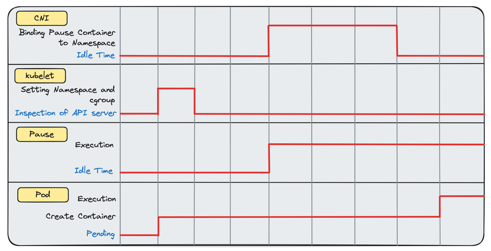
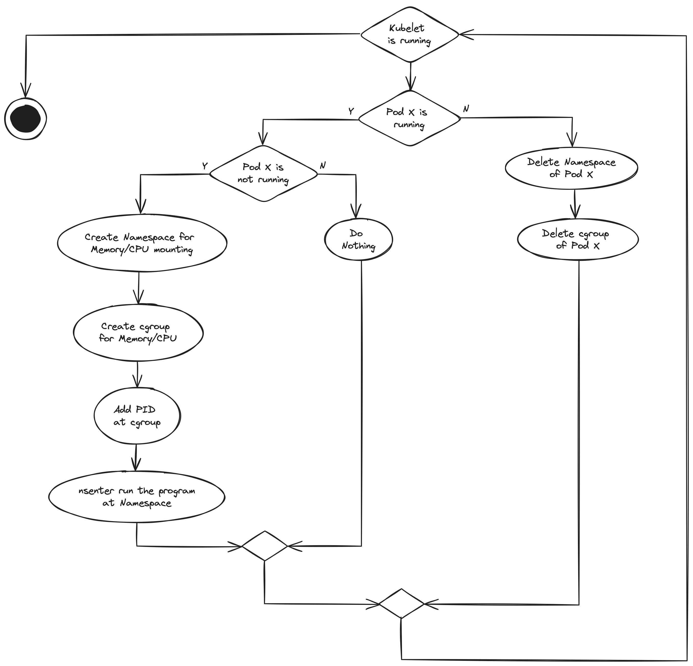
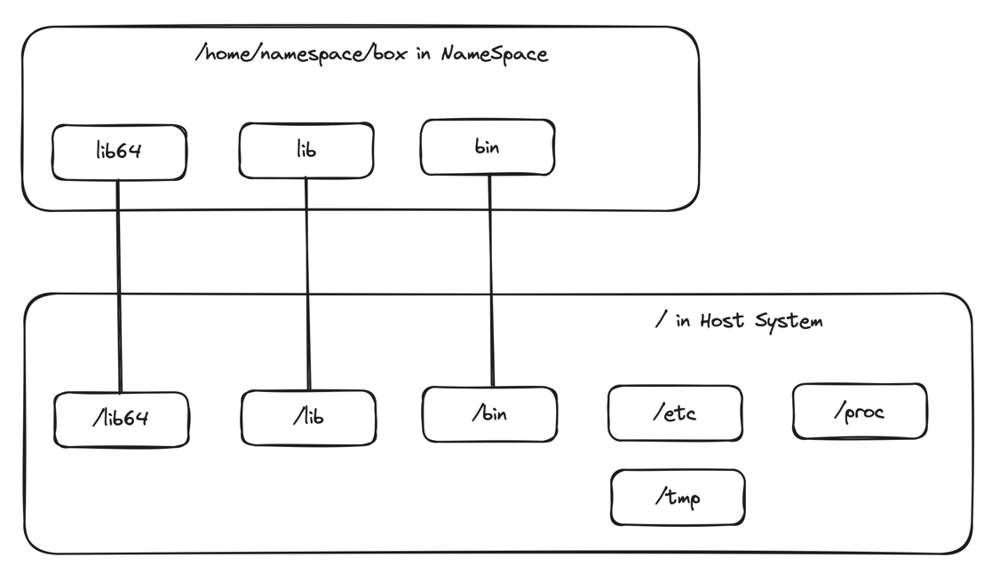
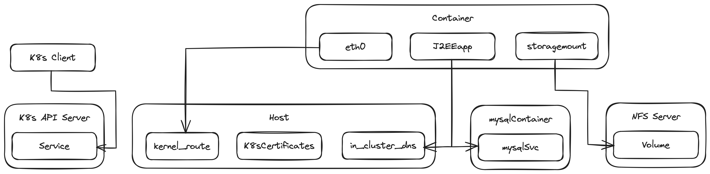

## 3. 파드 생성하기

> - 리눅스 기본 요소의 기초
>   - 쿠버네티스는 다양한 리눅스 기본 요소들이 모여 만들어짐
> - 쿠버네티스에서 리눅스 기본 요소 사용하기
>   - `iptables`는 유연한 방법으로 트래픽을 전달하거나 방화벽을 만드는 데 사용할 수 있는 리눅스 기본 요소
> - 도커를 사용하지 않고 처음부터 파드 만들기
>   - `chroot`를 사용해 모든 리눅스 배포판에서 파드와 유사한 구성을 만들 수 있음
>   - 쿠버네티스 서비스는 일반적으로 `iptables` 모드로 실행되는 `kube-proxy`에 의해 구현됨
> - 시간이 지나면서 특정 쿠버네티스의 플러그인이 진화하는 이유
>   - 운영 환경 시나리오에서 파드를 실행하고 싶다면 스토리지, 스케줄링, 네트워킹을 정교한 방법으로 관리해야 함

- 리눅스 기본 요소: 프로세스 관리를 위한 리눅스 OS의 기본적인 빌딩 블록
- CNI 공급자: 파드에 IP 주소를 제공하는 실행 프로그램
- `kubelet`이 컨테이너 시작에 하는 역할

  

  - 파드가 처음 만들어질 때와 실행 상태로 선언되는 시점 사이의 간격이 큼(지연)
    - 지연 시간 동안 리눅스 기본 요소들이 컨테이너(container)를 만들기 위해 소환됨
    - `kubelet`은 컨테이너를 실행해야 함
      - `kubelet`은 Pause 컨테이너를 시작해 리눅스 OS의 컨테이너 네트워크를 생성할 시간을 제공함
        - Pause 컨테이너: 새로운 컨테이너 네트워크 프로세스와 프로세스 ID(PID)를 <mark>부트스트래핑</mark>하기 위한 home directory를 만들기 위해 존재함
  - 파드를 궁극적으로 실행 상태로 만들기 위해 `kubelet`에 의해 트리거되고 <mark>리눅스 기본 요소들</mark>이 사용됨
    - 컨테이너 런타임은 `nsenter`(리눅스 기본 요소의 예)를 활용해 스토리지를 관리함
      - 바인드 마운팅(bind mounting): 한 위치에서 다른 위치로 폴더 연결
        - 일반적으로 쿠버네티스 파드에서 스토리지는 바인드 마운팅을 포함함. 컨테이너가 파일 트리 내의 특정 하위 경로에 있는 디렉터리를 볼 수 있게 함
        - 파드 스토리지에 대한 액세스 허용. 컨테이너 런타임(도커 or `crictl`)의 사용에 의존하지 않고 `nsenter` 등을 통해 격리된 프로세스에서 사용 가능한 디렉터리를 조사할 수 있음

### 3.1. kind로 쿠버네티스 기본 요소 살펴보기
> `kind`(쿠버네티스 개발자 도구)를 사용하면 쿠버네티스 환경에 대한 참조를 쉽게 생성할 수 있음

| 클러스터 타입          | 관리자            | `kubelet` 타입      | 스왑 가능 여부             |
|------------------|----------------|-------------------|----------------------|
| `kind`           | 도커 상용자         | 도커 컨테이너           | O(운영 환경에서 사용하는 용도 X) |
| GKE(구글 쿠버네티스 엔진) | 구글             | GCE(구글 컴퓨트 엔진) 노드 | X                    |
| 클러스터 API         | 실행 중인 마스터 클러스터 | 선택한 공급자 클라우드의 VM  | X                    |

- `kind` 클러스터 아키텍처를 운영 환경에서 실행하는 일반 클러스터와 비교해보면 운영 환경에 친화적이지 않음
  - `kind`는 리소스를 교환할 수 있으므로 컨테이너가 메모리를 디스크 공간으로 사용할 수 있음. 많은 컨테이너가 갑자기 더 많은 메모리를 필요로 하는 경우 성능과 컴퓨팅 비용의 문제가 발생함
  - 따라서 `kind`는 학습용으로 적합함. 학습용으로 사용할 경우 다음과 같은 이점이 있음
    - 비용이 들지 않음
    - 몇 초안에 설치 가능
    - 필요한 경우, 몇 초 안에 다시 만들 수 있음
    - 아무런 문제없이 기본적인 쿠버네티스 기능을 실행할 수 있음
    - 거의 모든 네트워킹 및 스토리지 공급자를 실행할 수 있어 쿠버네티스를 시작하기에 충분히 현실적임

### 3.2. 리눅스 기본 요소란 무엇인가?
> 리눅스 기본 요소들(Linux primitives)은 리눅스 OS의 기본적인 빌딩 블록
> ex. `iptables`, `ls`, `mount` 등
> 쿠버네티스의 플러그인과 추가 기능 모두 동일한 기본 빌딩 블록들을 기반으로 하므로 리눅스 기본 요소들을 아는 것은 엄청난 도움이 됨

- `kube-proxy`(네트워크 프록시): `iptables` 규칙을 생성하고, 컨테이너 네트워크 문제를 디버기하기 위해 `iptables` 규칙을 검사함(`iptables -L`)
  - 컨테이너 네트워크 인터페이스(CNI) 공급자는 네트워크 정책 구현과 관련된 다양한 작업에 네트워크 프록시 사용함
- `CSI`(컨테이너 스토리지 인터페이스): `kubelet`과 스토리지 기술 사이의 통신을 위한 소켓을 정의함
  - Pulre, GlusterFS, vSAN, 일레스틱 블록 스토어(EBS), 네트워크 파일 시스템(NFS) 등
  - 클러스터에서 `mount`를 실행하면 `kubectl`이나 다른 네이티브가 아닌 OS 도구에 의존하지 않고 쿠버네티스가 관리하는 컨테이너와 볼륨 마운트의 현황을 보여줌
  - 쿠버네티스에서 로우 레벨의 스토리지 오류를 해결하는 경우의 일반적인 디버깅 기법
- `unshare`, `mount`: 격리된 프로세스를 생성할 때 사용
  - 컨테이너를 만드는 기술에 의해 실행돼야 할 때가 많음. 쿠버네티스 클러스터에서 위협을 모니터링할 때 root 권한을 필요로하는 명령어를 실행할 수 있다는 것이 중요한 보안 경계임

#### 3.2.1. 리눅스 기본 요소는 리소스 관리 도구다
> `ls`는 시스템 관리 측면에서 강력한 리소스 관리 도구

- `ls`를 통해 알 수 있는 사항들
  - 특정 파일에 접근할 수 있는지 여부
  - 임의의 디렉터리에서 사용할 수 있는 파일
  - 파일이 가진 기능(ex. 실행 권한)
- 리눅스 기본 요소의 관점: **_"everything is a file"_**
  - 리눅스와 다른 OS(ex. 윈도우) 사이의 핵심적인 차별화 요소임
    - 쿠버네티스 클러스터에서 윈도우를 실행하는 경우 객체를 나타내는 통일된 표현이 없으므로 이벤트 상태를 검사하고 모니터링하는 기능이 더 복잡해짐. 많은 윈도우 객체가 메모리에 저장되고, 윈도우 API를 통해서만 액세스 가능하며, 파일 시스템을 통해서는 액세스할 수 없음
    - 일반적으로 리눅스 관리자는 평범한 텍스트 파일을 사용해 거의 모든 시스템 관리 측면을 수행함

#### 3.2.2. 모든 것은 파일(또는 파일 디스크립터)이다
> 리눅스 기본 요소들은 어떤 파일에 대한 조작, 이동, 추상화를 제공하는 작업을 하는 경우가 많음

- 리눅스는 전적으로 컨트롤 기본 요소들로 파일 추상화를 사용하도록 설계됨
  - `ls` 명령어는 파일에서 동작함
    1. 파일을 보고 해당 파일 내부의 파일 이름을 읽음
    2. 표준 출력(터미널에 출력되도록 하는 파일)에 문자열로 출력함
- 리눅스에서 모든 것이 파일임
  - 디렉터리는 파일이지만 다른 파일의 이름을 포함함
  - 디바이스도 리눅스 커널에 파일로 표시됨
    - 디바이스는 파일로 액세스할 수 있으므로 `ls` 같은 명령어를 사용해 이더넷 장치가 컨테이너 내부에 연결되어 있는지 확인할 수 있음
  - socket과 <mark>pipe</mark>도 프로세스가 통신을 위해 지역적으로 사용할 수 있는 파일임
    - `kubelet`이 볼륨 공급자와 통신하고 파드에 스토리지를 제공하는 방법을 정의하기 위해 <mark>CIS</mark>가 추상화를 활용함

#### 3.2.3. 파일들은 합성이 가능하다
> `|`(pipe) 문자를 사용해 한 명령어에서 출력 결과를 가져와 다른 명령어에서 처리할 수 있음

- 가장 일반적인 쿠버네티스 관리 작업
  - `etcd`가 클러스터 내에서 실행 중이고 정상 상태 여부를 확인함
    ```bash
    # 컨테이너로 실행하는 경우, 쿠버네티스 Control Plane을 실행하는 노드 내부에서 확인 가능
    # Control Plane은 거의 항상 중요한 etcd 프로세스를 실행함
    $ ls /var/log/containers/ | grep etcd
    etcd-kind-control-plane_kube_system_etcd-44daab302813923f188d864543c....log
    ```
  - 출처를 알 수 없는 쿠버네티스 클러스터에 있는 경우, `etcd` 관련 구성 리소스가 있는 위치를 찾을 수 있음
    ```bash
    $ find /etc | grep etcd; find /var | grep etcd
    ```
- `etcd`가 컨테이너에서 실행되는 이유
  - 운영 환경의 클러스터에서는 `etcd`를 나머지 컨터이너와 분리된 위치에서 실행하는 것이 일반적. 디스크와 CPU 리소스에 대한 경쟁을 방지할 수 있음
  - 작은 규모의 클러스터나 개발자 클러스터는 단순성을 위해 모든 Control Plane 컴포넌트를 한 곳에서 실행함
    - 컨테이너를 다시 시작하는 경우에도 `etcd`가 로컬 디스크에 저장되어 컨테이너 볼륨이 손실되지 않는 한 컨테이너에서 잘 실행될 수 있음

#### 3.2.4. kind 설정

- `kind`는 다른 의존성을 갖지 않고 도커 컨테이너 내부에서 쿠버네티스 클러스터를 만듦
  - 개발자는 VM을 만들거나 다른 무거운 구성을 할 필요 없이 로컬에서 많은 노드를 갖는 현실적인 클러스터를 시뮬레이션 할 수 있음(개발과 연구 목적)
- 기본적인 쿠버네티스 해킹 환경으로 `kind`를 설정하는 워크플로우
  1. 도커 설치
  2. `/user/local/bin/kubectl`에 `kubectl` 설치
  3. `/user/local/bin/kind`에 `kind` 설치
  4. `kubectl get pods`를 실행하여 설치 상태 테스트
  5. `kind` 클러스터 생성
      ```bash
      $ kind delete cluster --name=kind   # 이전 클러스터가 실행 중인 경우 kind 클러스터 삭제
      Deleting cluster "kind" ...
    
      $ kind create cluster               # kind 클러스터 시작
      Creating cluster "kind" ...
       ? Ensuring node image (kindes/node:v1.17.0) ?
       ? Preparing nodes ?
       ? Writing configuration ?
      ?? Starting control-plane ?
      ```
  6. 파드 목록 조회
      ```bash
      $ kubectl get pods --all-namespaces
      NAMESPACE    NAME                     READY  STATUS   AGE
      kube-system  coredns-6955-6bb2z       1/1    Running  3m24s
      kube-system  coredns-6955-82zzn       1/1    Running  3m24s
      kube-system  etcd-kind-control-plane  1/1    Running  3m40s
      kube-system  kindnet-njvrs            1/1    Running  3m24s
      kube-system  kube-proxy-m9gf8         1/1    Running  3m24s
      ```
  7. 쿠버네티스 노드 조회
      ```bash
      $ docker ps
      CONTAINER ID  IMAGE                 COMMAND
      776b91720d39  kindest/node:v1.17.0  "/usr/local/bin/entr..."
      
      CREATED        PORTS                      NAMES
      4 minutes ago  127.0.0.1:32769->6443/tcp  kind-control-plane
      ```
  8. ssh로 노드 접속
      ```bash
      # 노드(컨테이너) 내부에서 실행
      $ docker exec -t -i 776b91720d39 /bin/sh
      ```
- 도커에서 쿠버네티스가 실행되는 방법: [`kind`에 대한 도커 이미지 참고](http://mng.bz/nYg5)
  - 도커 컨테이너가 다른 도커 컨테이너를 실행할 수 있음

### 3.3. 쿠버네티스에서 리눅스 기본 요소 사용하기
> 쿠버네티스에서 핵심 기능이 동작하는 방법은 리눅스 기본 요소들이 동작하는 방식과 연결됨
> 리눅스 기본 요소들은 컨테이너를 실행하기 위한 스캐폴드(scaffold)를 형성함

- scaffold: 초기 프로젝트의 뼈대를 만들어주는 행위. `README`, License, 디렉터리 구조, 컴파일 설정 등을 자동으로 생성하는 것
- service mash, container native storage: 기본 OS 기능을 조합한 관리자

#### 3.3.1. 파드 실행을 위한 전제 조건
> 파드: 쿠버네티스 클러스터에서 기본적인 실행 단위. 데이터 센터에서 실행할 컨테이너를 정의하는 방식
    
| 명령어        | 설명                                                                                                                                                                                                    |
|------------|-------------------------------------------------------------------------------------------------------------------------------------------------------------------------------------------------------|
| `swapoff`  | <mark>CPU와 메모리 설정을 존중하는 방식으로</mark> 쿠버네티스를 실행하기 위한 전제 조건인 메모리 스와핑을 비활성화                                                                                                                               |
| `iptables` | (일반적으로) 네트워크 프록시에 대한 핵심 요구사항. 파드에 보내는 `iptables` 규칙을 생성                                                                                                                                               |
| `mount`    | 경로의 특정 위치에 리소스 연결<br/>(ex. 디바이스를 홈 디렉터리에 폴더로 노출시킴)                                                                                                                                                    |
| `systemd`  | `kubelet`을 시작함<br/>(`kubelet`: 클러스터에서 모든 컨테이너를 관리하기 위해 실행되는 핵심 프로세스)                                                                                                                                  |
| `socat`    | 프로세스 사이의 양방향 정보 스트림 설정<br/>`kubectl portforward`의 필수 사항                                                                                                                                               |
| `nsenter`  | (네트워킹, 스토리지, 프로세스 측면에서) 프로세스의 다양한 네임스페이스로 들어가 진행 상태를 확인할 수 있는 도구<br/>리눅스 네임스페이스는 외부에서 로컬로 주소를 지정할 수 없는 특정 리소스를 가짐. 쿠버네티스 클러스터에 있는 파드의 고유 IP 주소는 다른 파드와 공유되지 않음(일반적으로 동일한 노드에서도 별도의 네임스페이스에서 실행됨)      |
| `unshare`  | 프로세스가 네트워크, 마운트, PID 관점에서 격리되어 실행되는 하위 프로세스를 만들 수 있게 함<br/>컨테이너의 **PID 1 현상**(쿠버네티스 컨테이너가 자신을 전 세계의 유일한 프로그램이라고 생각하는 문제)을 확인할 수 있음<br/>`mount`(`/위치`)와 네트워크 네임스페이스(IP주소)를 격리할 수 있음(`docker run`과 유사함) |
| `ps`       | 실행 중인 프로세스 나열<br/>`kubelet`은 프로세스가 언제 종료됐는지 등을 확인하기 위해 프로세스를 계속 모니터링해야 함<br/>클러스터에 좀비 프로세스가 있는지, 권한을 가진 프로세스가 부적절한 상태(새로운 하위 프로세스를 많이 생성함)에 있는지 등을 확인할 수 있음                                           |

- 파드를 생성할 때 격리(isolation), 네트워킹, 프로세스 관리 구현 기능에 의존함
  - 리눅스 OS에서 사용할 수 있는 유틸리티(기본 요소)를 사용해 만들 수 있음 (`kubelet`이 파드를 시작하는 데 필수 기능)

#### 3.3.2. 간단한 파드 실행하기
> 일반적으로는 수동적으로 파드를 만들지 않고, Deployment, DemonSet, Job을 생성함

- 파드 실행 스크립트
  ```bash
  $ cat << EOF > pod.yaml
  apiVersion: v1
  kind: Pod                               # API 객체 타입
  metadata:
    name: core-k8s
    labels:                               # 레이블의 메타데이터를 통해 이 파드를 로드 밸런서 대상으로 선택하거나 쿠버네티스 API 서버에 대한 쿼리의 필터로 선택할 수 있음
      role: just-an-example
        app: my-example-app
        organization: friends-of-manning
        creator: jay
  spec:
    containers:
      - name: any-old-name-will-do
        image: docker.io/busybox:latest   # 이 docker.io 이미지 이름은 실제여야 하며, 인터넷에서 가져올 수 있거나 로컬 컨테이너 이미지로 태그되어 있어야 함
      command: ['sleep', '10000']
        ports:
          - name: webapp-ports
            containerPort: 80
            protocol: TCP
  EOF
  
  $ kubectl create -f pod.yaml            # 쿠버네티스 기본 네임스페이스에 파드를 생성함
  ```
  - BusyBox 파드: 기본 컨테이너의 동작을 조사하기 위해 실행할 수 있는 최소한의 기능을 갖는 리눅스 이미지
    - NGINX 파드를 표준으로 많이 사용함
    - BusyBox 파드는 `ip a` 명령이 제공되고 유틸리티들이 번들로 제공됨
  - `webapp-port`: 80번 포트에서 서비스를 실행하고 있지 않으나 NGINX 같은 이미지로 대체하면 로드 밸런싱된 포트로 설정할 수 있음
- 파드 실행 후 OS에 대한 프로세스의 가시성(visibility)
  ```bash
  $ ps -ax | wc -l              # 기존에 실행 중인 프로세스 개수 계산
  706
  
  $ kubectl create -f pod.yml   # 파드 생성
  pod "core-k8s" deleted
  
  $ ps -ax | wc -l              # 파드 생성 후 프로세스 개수 계산
  707
  ```

#### 3.3.3. 파드의 리눅스 의존성 탐색하기
> 파드는 CPU, 메모리, 디스크 같은 기본적인 컴퓨팅 유닛에 액세스해야 하는 프로그램을 실행함

- 파드는 일반적인 프로그램과 같음
  - 키보드 입력, 파일 나열 등을 사용할 수 있게 해주는 공유 라이브러리나 OS에 특화된 저수준 유틸리티를 사용함
  - 네트워크 호출이나 수신이 될 수 있도록 TCP/IP 스택의 구현과 함께 동작할 수 있는 클라이언트에 액세스 함(system call)
  - 다른 프로그램이 자신의 메모리를 덮어쓰지 않도록 보장하기 위한 메모리 주소 공간이 필요함
- 파드 생성 시 `kubelet`의 역할: 리눅스 시스템 관리자가 하는 일을 수행함
  1. 프로그램이 실행되기 위한 (<mark>CPU, 메모리, 네임스페이스 제한을 갖는</mark>) 격리된 home을 생성함
  2. 홈이 이더넷 연결이 되는지 확인
  3. DNS를 확인하거나 스토리지에 액세스하기 위한 일부 기본 파일에 대한 액세스 권한을 프로그램에 부여함
  4. 프로그램에게 다른 파드로 이동해서 시작하는 것이 안전하다고 알려줌
  5. 프로그램이 종료될 때까지 대기함
  6. 프로그램이 사용한 공간과 자원을 정리함
- 파드의 수명주기: `kubelet`이 실행되는 동안 지속적으로 수행되는 작업을 정의함

  

  - 파드의 컨테이너는 언제든지 죽을 수 있으므로 제어 루프를 통해 컨테이너를 다시 살려냄(fractal 방식 제어 루프)
  - `kubelet`이 실행되는 한, 파드를 확인하고 시작할 수 있는 지속적인 조정 루프가 있음
  - `nsenter`로 리눅스에서 컨테이너를 실행하고 관리할 수 있지만 <mark>다른 컨테이너 런타임이나 OS로 변환되지 않음</mark>
    - `kubelet`은 CRI(Container Runtime Interface, 일반적으로 `containerd`로 구현됨)를 따르므로 쿠버네티스는 컨테이너 런타임에 대한 지식을 갖지 않아도 됨(도커를 사용하지 않아도 됨)
      - 표준 `containerd` 실행 파일은 `kubelet`에 CRI를 제공하고, 이 CRI가 호출되면 `containerd`는 내부적으로 low-level container runtime을 호출함
- 파드 확인
  ```bash
  $ kubectl get pods -o yaml
  ```
  - JSONPath를 사용하여 파드 검사: 정보 필터링
    ```bash
    # status 확인
    $ kubectl get pods -o=jsonpath='{.items[0].status.phase}'   # 파드 생성에 대한 쿼리
    Running                                                     # 파드가 OS에 의해 모니터링되고 있고 상태가 실행 중임
    
    $ kubectl get pods -o=jsonpath='{.items[0].status.podIP}'   # 파드의 IP 주소를 쿼리
    10.244.0.11                                                 # 파드가 호스트와 별도의 IP 공간(네트워크 네임 스페이스)에 있음
    
    $ kubectl get pods -o=jsonpath='{.items[0].status.hostIP}'  # 실행 중인 호스트의 IP 주소를 쿼리
    127.17.0.2
    ```
  - 파드에 마운트한 데이터 검사
    - 쿠버네티스가 모든 파드에 제공하는 필드: `default-token` 볼륨, DNS 정보
      - `default-token` 볼륨: 파드가 API 서버와 통신하고 phone home 하기 위한 인증서를 제공함
        - phone home: 네트워크 위치, 사용자 이름, 기타 데이터를 다른 컴퓨터에 보고하는 보안 시스템의 동작
      ```bash
      # mount: 파드 내의 볼륨을 마운트(연결)
      $ kubectl exec -t -i core-k8s mount | grep resolv.conf
      /dev/sda1 on /etc/resolv.conf type ext4 (rw, relatime)    # /etc/resolv.conf 파일(리눅스에 DNS 서버의 위치를 알려줌)이 다른 곳에 마운트되어 있음
      ```
      - 일반적으로 `/dev/sda1`은 `/var/lib/containerd` 폴더에 해당함
        ```bash
        # 리눅스에서 파일 위치를 찾는 방법
        $ find /var/lib/containerd/ -name resolv.conf
        ```
- `kubelet`은 관리자로서 프로세스를 관리하고 볼륨을 검사하고 종료할 수 있음
  - `containerd`(컨테이너 런타임)에 의해 만들어진 프로세스는 OS에 의해 관리됨. VM에서 하이퍼바이저는 VM이 어떤 프로세스를 실행 중인지 모름
- 파드의 특징
  - API 서버에 액세스하기 위해 인증서가 있는 스토리지 볼륨을 가짐
    - 내부 쿠버네티스 API에 간단하게 액세스할 수 있음
    - 쿠버네티스 파드가 다른 파드나 서비스 등을 생성할 수 있게 하는 오퍼레이터, 컨트롤러 패턴을 기반이 됨
  - 10번 서브넷에 고유한 IP 주소를 가짐(172번 서브넷의 호스트 IP와 다름)
  - 10.244.0.11 IP 주소에 있는 내부 네임스페이스의 80번 포트에서 트래픽을 처리함
    - 클러스터의 다른 파드들도 이 포트에 액세스할 수 있음
  - 클러스터를 문제없이 실행할 수 있음. 호스트는 완전하게 관리 가능하고 가시성을 갖는 고유한 PID가 있는 컨테이너를 가짐

### 3.4. 처음부터 파드 만들기
> 쿠버네티스가 존재하기 이전의 컨테이너 관리 시스템
> `kubelet`의 작동하는 프로세스

- 파드의 기본 특징
  - 스토리지
  - IP 주소 지정
  - 네트워크 격리
  - 프로세스 식별
- 파드 기능 구현 사전 작업
  1. `kind` 클러스터에 접근
     ```bash
     docker ps | grep kind | cut -d' ' -f 1   # kind 컨테이너 ID 나열
     docker exec -t -i container_id /bin/sj   # 노드로 이동
     ```
  2. Vim 편집기 설치
    ```bash
    root@kind-control-plane:/# sudo apt-get update -y
    root@kind-control-plane:/# apt-get install vim
    ```

#### 3.4.1. chroot를 사용해 격리 프로세스 생성하기
> 정제된 컨테이너 생성(Bash 쉘을 실행하는 데 필요한 것만 있는 폴더)



- `chroot`: 프로세스를 위한 격리된 root를 생성함(파일 시스템에 대한 다른 정보를 보거나 조작할 수 없음)
  1. 실행할 프로그램과 프로그램이 실행돼야 하는 파일 시스템 위치를 결정함
  2. 프로세스가 실행될 환경을 만듦
     - `lib64` 디렉터리에 있는 리눅스 프로그램들이 Bash 등을 실행하는데 필요하므로 새로운 루트로 불러와야 함
  3. 실행하고 싶은 프로그램을 `chroot` 처리된 위치로 복사함
- chroot 처리된 네임스페이스에서 Bash 터미널 실행
  ```bash
  # chroot.sh
  #/bin/bash
  mkdir /home/namespace/box
  
  mkdir /home/namespace/box/bin                 # Bash 프로그램에 대한 종속성으로서 bin 및 lib 디렉터리를 갖는 박스를 만듦
  mkdir /home/namespace/box/lib
  mkdir /home/namespace/box/lib64
  
  cp -v /usr/bin/kill /home/namespace/box/bin/   # 루트 디렉터리에서 Bash를 실행할 수 있도록 기반 OS의 모든 프로그램을 박스에 복사
  cp -v /usr/bin/ps /home/namespace/box/bin
  cp -v /bin/bash /home/namespace/box/bin
  cp -v /bin/ls /home/namespace/box/bin
  
  cp -r /lib/* /home/namespace/box/lib/          # 프로그램의 라이브러리 종속성을 lib/ 디렉터리에 복사
  cp -r /lib64/* /home/namepspace/box/lib64/
  
  mount -t proc proc /home/namespace/box/proc   # /proc 디렉터리를 마운트
  
  chroot /home/namespace/box /bin/bash          # 샌드박스로 처리된 디렉터리에서 격리된 Bash 프로세스를 시작함
  ```
  ```bash
  root@kind-control--plane:/# ./chroot0.sh
  '/bin/bash' -> '/home/namespace/box/bin/bash'
  '/bin/ls' -> '/home/namespace/box/bin/ls'
  '/lib/x86_64-linux-gnu/libtinfo.so.6' -> '/home/namespace/box/lib/libtinfo.so.6'
  '/lib/x86_64-linux-gnu/libdl.so.2' -> '/home/namespace/box/lib/libdl.so.2'
  '/lib/ld-linux-x86-64.so.2' -> '/home/namespace/box/lib/ld-linux-x86-64.so.2'
  
  bash-5.0# ls
  bin lib lib64
  ```

#### 3.4.2. 마운트를 사용해 작업을 위한 프로세스 데이터 제공하기
> 컨테이너는 클라우드나 호스트 시스템 같은 다른 스토리지에 액세스 해야 함
> `mount`: 디바이스를 OS의 /(root) 디렉터리 아래에 있는 모든 디렉터리에 노출할 수 있음

- 이전 프로그램을 실행하는데 나중에 폐기할 수 있는 임시 위치에 데이터를 기록하고 싶은 경우
  ```bash
  mount -bind /tmp/ /home/namespace/box/data
  
  chroot /home/namespace/box /bin/bash
  ```
  - `/tmp`의 내용을 컨테이너에 마운트하면 누구든 조작하거나 읽을 수 있음
- 생성한 컨테이너의 일부 데이터 가져오기
  ```bash
  root@kind-control-plane:/# touch /tmp/a
  root@kind-control-plane:/# touch /tmp/b
  root@kind-control-plane:/# touch /tmp/c
  root@kind-control-plane:/# ./chroot0.sh
  'bin/bash' -> '/home/namespace/box/bin/bash'
  'bin/ls' -> '/home/namespace/box/bin/ls'
  '/lib/x86_64-linux-gnu/libtinfo.so.6' -> '/home/namespace/lib/x86_64-linux-gnu/libtinfo.so.6'
  '/lib/x86-64-linux-gnu/libdl.so.2' -> '/home/namespace/lib/x86_64-linux-gne/libdl.so.2'
  '/lib64/ld-linus-x86_64.so.2' -> '/home/namespace/box/lib/ld-linus-x86-64.so.2'
  
  bash-5.0# ls data
  a b c
  ```
- 컨테이너 프로세스 확인
  ```bash
  bash-5.0# ps
    PID  TTY  TIME      CMD
   5027  ?    00:00:00  sh
  79455  ?    00:00:00  bash
  79557  ?    00:00:00  ps
  ```

#### 3.4.3. unshare를 통한 프로세스 보안
> 프로세스를 가리는 것(blinder)과 프로세스를 보호하는 것은 다름
> 프로세스 격리

- 프로세스를 가리는 경우: `kubelet`이 죽을 수 있음. `chroot` 처리된 프로세스가 다른 폴더에 액세스할 수 없음에도 중요한 시스템 프로세스를 다음과 같이 제거할 수 있음(전체 클러스터를 중단시킬 수 있는 CVE, Common Vulnerabilities and Exposures)
  1. 도커가 실행되도록 `kind` 클러스터에서 `ps -ax`를 실행함
  2. `kubelet`의 ID(ex. 744)를 가져옴(`ps -a | grep kubelet`)
  3. `chroot0.sh` 네임스페이스 스크립트 실행
  4. `bash-5.0#` 프롬프트에서 `kill 744` 실행
- `unshare`: `chroot`를 이용해 Bash를 프로세스 공간이 완전히 격리된 터미널에서 실행할 수 있음(`kubelet`을 죽일 수 없음)
  - 컨테이너화된 운영 환경에서 격리(isolation)를 해결해야 함. 컨테이너가 호스트에 대해 완전한 액세스 권한을 갖게 되면 `kubelet` 프로세스를 죽이거나 시스템 필수 파일을 삭제해서 영구적인 손상을 줄 수 있음
  ```bash
  # 디렉터리를 마운트 해제한 경우 코드가 동작하지 않음
  root@kind-control-plane: /# unshare -p -f
                              -mount-proc=/home/namespace/box/proc
                              chroot /home/namespace/box /bin/bash    # 네임스페이스 내에서 실행되는 새로운 셀 생성
  
  bash-5.0# ps -ax
  PID  TTY  STAT  TIME  COMMAND
  1    ?    S     0:00  /bin/bash   # 네임스페이스에 표시되는 모든 프로세스를 관찰함. PID가 낮아짐
  2    ?    R+    0:00  /ps -ax
  ```
  - 컨테이너 격리 전에는 Bash의 PID가 79455로 호스트 시스템 상에서 실행됐지만, 격리 후에는 1로 컨테이너에서 실행됨
  - PID 1은 OS(`systemd`)에서 가장 먼저 활성화되는 프로세스 ID

#### 3.4.4. 네트워크 네임스페이스 생성하기
> 네트워크 격리
 
- 새로운 네트워크를 갖는 프로그램 실행
  ```bash
  root@kind-control-plane:/# unshare -p -n -f
    --mount-proc=/home/namespace/box/proc chroot /home/namespace/box /bin/bash
  
  bash-5.0# ip a
  1: lo: <LOOPBACK> mtu 65536 qdisc noop state DOWN group default ...
     link/loopback 00:00:00:00:00:00 brd 00:00:00:00:00:00
  2: tunl0@NONE: <NOARP> mtu 1480 qdisc noop state DOWN group default ...
     link/ipip 0.0.0.0 brd 0.0.0.0
  3: ip6tnl@NONE: <NOARP> mtu 1452 qdisc noop state DOWN group default ...
     link/tunnel6 :: brd ::
  ```
  - 일반적인 쿠버네티스 클러스터에서 실행되는 실제 파드(네트워크를 갖는 컨테이너, CNI)와 비교했을 때, `eth0` 디바이스가 부족함
    - `chroot`는 컨테이너화된 애플리케이션을 실행하는데 유용하지 않음

#### 3.4.5. 프로세스 상태 확인하기
> 컨테이너 네트워크 스택

- 일반 쿠버네티스 클러스터에서 실행되는 파드의 컨테이너 네트워크 정보 확인
  ```bash
  $ kubectl delete -f pod.yaml ;        # 3.3.2의 pod.yaml 실행
    kubectl create -f pod yaml
  
  $ kubectl exec -t -i core-k8s ip a    # 네트워크 인터페이스 나열
  1: lo: <LOOPBACK, LOWER_UP> mtu 65536 qdisc noqueue qlen 1
     link/loopback 00:00:00:00:00:00 brd 00:00:00:00:00:00
     inet 127.0.0.1/8 scope host lo
        valid_lft forever preferred_lft forever
     inet ::1/128 scope host
        valid_lft forever preferred_lft forever
  2: tunl0@NONE: <NOARP> mtu 1480 qdisc noop qlen 1
      link/ipip 0.0.0.0 brd 0.0.0.0
  3: ip6tnl0@NONE: <NOARP> mtu 1452 qdisc npop qlen 1
      link/tunnel6 00:00:00:00:00:00:00:00:00:00:00:00:00:00:00:00
      brd 00:00:00:00:00:00:00:00:00:00:00:00:00:00:00:00
  5: eth0@if10: <BROADCAST,MULTICAST,UP,LOWER_UP,M-DOWN>
        mtu 1500 qdisc noqueue
      link/ether 4a:9b:b2:b7:58:7c brd ff:ff:ff:ff:ff:ff
      inet 10.244.0.7/24 brd 10.244.0.255 scope global eth0
        valid_lft forever preferred_lft forever
      inet6 f380::489b:b2ff:feb7:587c/64 scope link
        valid_lft forever preferred_lft forever
  ```

#### 3.4.6. cgroup을 통한 CPU 조정하기
> `cgroup`: 클러스터에서 실행 중인 애플리케이션에 제공하는 CPU와 메모리의 양을 조정할 수 있음

- 컨테이너 CPU 조정
  ```bash
  $ cat << EOF > greedy-pod.yaml
  apiVersion: v1
  kind: Pod
  metadata
    name: core-k8s-greedy
  spec:
    containers:
      - name: any-old-name-will-do
        image: docker.io/busybox:latest
        command: ['sleep', '100000']
        resources:    # 쿠버네티스가 사용 가능한 CPU를 제한하도록 cgroup 생성
          limits:
              memory: "200Mi"
          requests:
              memory: "100Mi"
  EOF
  ```

#### 3.4.7. 리소스 스탠자 생성하기
> 스탠자: 전체 구성 정보에서 개별 구성 항목
> `cgroup`에서 `limits`를 정의할 때 `kubelet`이 수행하는 단계(`--cgroup-driver`)

- `cgroup`에서 `limits` 정의
  1. PID 생성(쿠버네티스 파드 샌드박스)
  2. PID에 대한 `limits`을 OS에 씀
- 프로세스가 적은 수의 바이트만 사용하도록 하는 방법. `ls` 명령어를 실행하는 데 필요한 메모리 양 추정
  ```bash
  root$kind-control-plane:/# echo $$
  79455
  
  root$kind-control-plane:/# mkdir /sys/fs/cgroup/memory/chroot0    # cgroup 생성
  
  root@kind-control-plane:/# echo "10" >
    /sys/fs/cgroup/memory/chroot0/memory.limit_in_bytes    # 컨테이너에 10 바이트 메모리만 할당하면 기본적인 작업을 수행할 수 없음
  
  roo@kind-control-plane:/# echo "0" >
    /sys/fs/cgroup/memory/chroot0/memory.swappiness        # 컨테이너가 스왑 공간을 할당하지 않게 함
  
  root@kind-control-plane:/# echo 79455 >
    /sys/fs/cgroup/memory/chroot0/tasks                    # OS에 cgroup에 대한 프로세스가 79455(chroot0 Bash 프로세스)임을 알림
  
  bash-5.0# ls
  bash: fork: Cannot allocate memory
  ```

### 3.5. 현실에서 파드 사용하기
> 일반적인 마이크로서비스는 다른 많은 서비스와 통신, 서비스에 새로운 인증서를 마운트, 내부 DNS를 사용해 다른 서비스를 탐색해야 함

- 컨테이너는 다른 컨테이너와 통신할 수 있음

  

#### 3.5.1. 네트워킹 문제

- 쿠버네티스 컨테이너에 필요한 트래픽
  - 클러스터 내부나 파드에서 파드 사이의 연결을 위해 직접 라우팅된 트래픽
  - 다른 파드나 인터넷에 액세스하기 위해 라우팅된 트래픽
  - 정적 IP 주소를 사용하는 서비스 뒤에서 엔드포인트 역할을 위해 로드 밸런싱된 트래픽

#### 3.5.2. iptables를 활용하여 kube-proxy의 쿠버네티스 서비스 구현 방법 이해하기
> 쿠버네티스 서비스에서 API 계약 정의
> **_"이 IP에 액세스하면 여러 엔드포인트 중 서비스가 가능한 하나로 자동으로 전달된다."_**
> `iptable`프로그램을 사용해 저수준 네트워크 라우팅을 수행하는 `kube-proxy`로 구현

- `iptables`: 커널에 규칙(네트워크 트래픽을 처리하기 위함) 추가. 쿠버네티스 서비스가 파드에 트래픽을 라우팅하기 위함
  ```bash
  iptables -A INPUT -s 10.1.2.3 -j DROP    # 10.1.2.3에서 들어오는 모든 트래픽을 폐기함
  ```
- 파드에서 필요한 규칙
  - 서비스 엔드포인트로 트래픽을 받아들이는 능력
  - 자체 엔드포인트에서 외부로 트래픽을 보내는 능력
  - 진행 중이 TCP 연결을 추적하는 능력(`conntrack`)
- `kind`에서 실행되는 실제 서비스 네트워킹 규칙이 구현되는 방법
  - 네트워크를 유지하는데 사용되는 모든 호스트 확인
    ```bash
    iptables-save | grep hostnames
    ```

#### 3.5.3. kube-dns 파드 사용하기

- `kube-dns` 파드: 쿠버네티스 앱에서 실행되는 파드의 타입
  - 어떤 쿠버네티스 클러스터에서도 실행됨
  - 특별한 권한을 갖고 있지 않으며, 호스트 네트워크가 아닌 일반적인 파드 네트워크를 사용함
  - 트래픽을 DNS 포트 표준으로 널리 알려진 53번 포트로 보냄
  - 기본적으로 `kind` 클러스터에서 실행됨
- 라우팅 경로 확인
  ```dns
  root@kind-control-plane:/# ip route
  default via 172.18.0.1 dev eth0
  10.244.0.2 dev vethfc5287fa scope host
  10.244.0.3 dev veth31aba882 scope host
  10.244.0.4 dev veth1e578a9a scope host
  172.18.0.0/16 dev eth0 proto kernel scope link src 172.18.0.2
  ```
  - 특정 `veth` 디바이스로 라우팅
- 서비스 규칙을 통해 트래픽을 DNS 파드로 라우팅
  ```bash
  -A KUBE-SVC-ERIFXISQEP7F70F4 -m comment --comment             # KUBE-SVC-ERIFX로 액세스하면 KUBE-SEP-IT2Z 규칙에 따라 DNS 파드로 라우팅
                               "kube-system/kube-dns:dns-tcp"
                               -m statistic
                               --mode random
                               --probability 0.50000000000
                               -j KUBE-SEP-IT2ZTR26TO4XFTO      # -j: jump. 네트워크 트래픽을 서비스 엔드포인트(파드)로 전달
  ```
- 엔드포인트 규칙을 사용해 개별 포트에 대한 규칙 정의하기
  - 서비스로부터 트래픽이 수신되면 트래픽은 `KUBE-SEP` 규칙을 사용해 라우팅 됨. 파드는 외부 인터넷에 액세스하거나 트래픽 수신 가능
    ```bash
    -A KUBE-SEP-IT2Z.. -s 10.244.0.2/32
      -m comment --comment "kube-system/kube-dns:dns-tcp"
      -j KUBE-MARK-MASQ
    
    -A KUBE-SEP-IT2Z .. -s -p tcp
      -m comment --comment "kube-system/kube-dns:dns-tcp"
      -m tcp -j DNAT --to-destination 10.244.0.2:53
    ```
    - 목적지 포트가 명확하지 않은 경우 해당 IP 주소로 향하는 모든 트래픽에 대한 마지막 목적지 포트는 53번 포트(`kube-dns` 파드 서비스가 트래픽을 처리하는 엔드포인트. 실행 중인 CoreDNS 파드의 IP 주소)가 됨
      - `kube-dns`는 서비스 이름, `CoreDNS`는 `kube-dns` 서비스 엔드포인트를 구현하는 파드
    - 파드 중 하나가 비정상 상태가 되면 `KUBE-SEP-IT2Z`에 대한 특정 규칙이 네트워크 프록시인 `kube-proxy`에 의해 조정됨. DNS 파드의 정상적인 복사본으로만 트래픽이 전달됨
      - 네트워크 프록시의 목적은 쿠버네티스 클러스터의 모든 노드가 트래픽을 쿠버네티스 서비스로 전달할 수 있도록 관리하는 것

#### 3.5.4. 기타 문제 고려하기

- 스토리지: 여러 다양한 종류의 스토리지에 대한 액세스가 필요한 경우
  - 모든 컨테이너가 사용해야 하는 대규모 NAS(Network Attached Storage)가 있고 주기적으로 NAS가 마운트된느 방법을 변경해야 하는 경우
    - 셸 명령어를 수정하고 볼륨을 마운트하는 방식을 자동화하는 인프라 도구가 필요함
    - 스토리지 볼륨에 대한 연결이 실패했는지 보고하는 방법이 필요함
      - 쿠버네티스의 `StorageClass`, `PersisentVolume`, `PersistentVolumeClaim`
- 스케줄링: `cgroup` 계층 구조가 파드의 리소스 요구 사항과 부합하는 위치에 파드를 배치할 수 있도록 스케줄링해야 함
  - `cgroup` 설정 시 메모리를 너무 높게 설정하거나 메모리 요청에 대해 할당한 메모리가 충분하지 않은 환경에서 컨테이너를 실행하는 경우
    - 쿠버네티스 클러스터의 모든 노드를 중단시킬 수 있음
  - [Nomad](https://www.nomadproject.io/): Kubernetes-agnostic한 방법으로 스케줄링 문제를 해결하는 스케줄링 도구
    - 선호도, CPU, 메모리, 스토리지 가용성, 데이터 센터 토폴로지 등을 기반으로 실행하고자 하는 파드에 대해 단순하고 컨테이너 중심저거인 예측 가능한 노드를 선택함
- 업그레이드와 재시작
  - 특정 작업에 대한 PID를 기록해야 함
  - 더 이상 실행되지 않을 수도 있는 파드와 관련된 오래된 프로세스나 `cgroup`을 관리하는 것이 컨테이너화된 워크로드를 실행하는 데 중요함
    - DeploymentSet, StatefulSet, Job, DemonSet 측면에서 가장 자주 고려하는 애플리케이션의 쿠버네티스 데이터 모델
