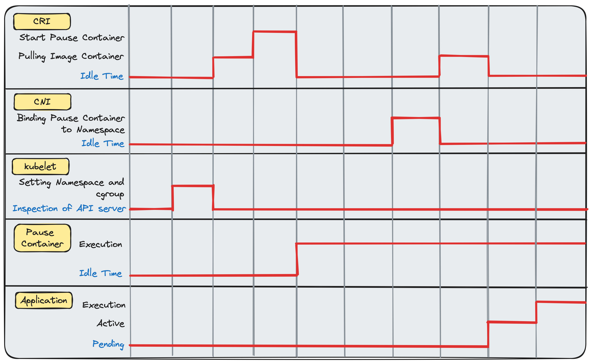
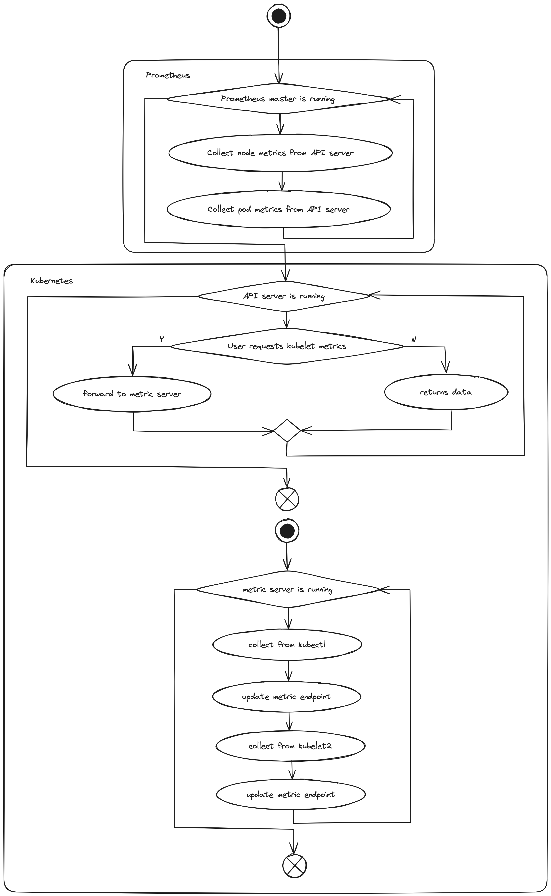

## 4. 파드 내 프로세스에서 cgroups 사용하기

> - `cgroups` 기초
>   - 커널은 컨테이너에 대한 `cgroup` 제한을 표시함
> - 쿠버네티스 프로세스 식별
>   - `kubelet`은 스케줄러 프로세스를 시작하고 API 서버에 미러링 함
>   - `kubelet`은 파드에서 프로세스 리소스 할당에 차이를 만드는 QoS 클래스를 갖고 있음
> - `cgroup의` 생성과 관리
>   - `cgroups`이 메모리 제한을 구현하는 방법을 검사하기 위해 간단한 컨테이너를 사용할 수 있음
> - `cgroup` 계층 구조를 살펴보기 위한 리눅스 명령어
> - `cgroup` v2와 `cgroup` v1의 차이점
> - 프로메테우스 설치와 파드의 리소스 사용 현황 확인
>   - Prometheus: 시계열 메트릭 aggregator. 클라우드 네이티브에서 모든 메트릭과 관찰 플랫폼의 실질적인 표준
>     - 높은 부하의 클러스터에 대한 실시간 metric을 보기 위해 Prometheus를 사용할 수 있음
>     - 세 가지 핵심 metric 유형: 게이지, 히스토그램, 카운터

- `cgroups`: 커널에서 자원을 서로 고립시키는 컨트롤 구조

### 4.1. 파드는 준비 작업이 완료될 때까지 유휴 상태다

- `kubelet`이 하는 일

  

  - 앱은 Pause 컨테이너가 네임스페이스에 추가될 때까지 유휴 상태임
  - `kubelet`의 특징
    - 컨테이너의 실행을 책임지는 CRI가 설치되어 있음
    - 컨테이너에 IP 주소를 제공하는 책임을 갖고 있는 CNI가 있음
    - 하나 이상의 Pause 컨테이너(`kubelet`이 내부에서 실행할 컨테이너의 네임스페이스와 cgroup을 생성하는 위치 표시자)를 실행함
- 리소스는 유한함
  - CNI의 Pause 컨테이너에 앞서 CNI가 실행되면 사용할 수 있는 네트워크가 없음
  - 이용 가능한 리소스가 없는 경우 `kubelet`은 파드를 실행할 장소에 대한 설정을 하지 않고 아무 일도 발생하지 않음
  - 모든 파드가 실행되기 전 Pause 컨테이너(파드 프로세스의 위치 표시자)가 실행됨
- 예제 프로그램: CPU, 메모리, 스토리지 요구사항
  ```text
  - Pi 계산: Pi 계산은 지속적인 CPU 사용을 위해 전용 코어에 대한 액세스가 필요함
  - 빠른 검색을 위한 위키피디아 콘텐츠 캐싱: Pi 프로그램용 해시 테이블에 위키피디아를 캐싱할 경우 CPU가 거의 필요하지 않지만, 약 100GB 정도의 메모리가 필요할 수 있음
  - 1TB짜리 데이터베이스 백업: Pi 프로그램용 스토리지에 데이터베이스를 백업하는 경우 메모리와 CPU가 거의 필요 없지만 대용량 영구 스토리지 디바이스가 필요함
  ```
  - 각 프로그램을 2개의 코어, 101GB 메모리, 1.1TB 스토리지로 실행할 경우, 다음과 같은 상황이 발생할 수 있음(이론적으로는 가능함)
    ```text
    - Pi 프로그램이 잘못 작성된 경우, 데이터베이스의 스토리지 용량을 초과할 수 있음
        - ex. 중간 결과를 영구 디스크에 저장함
    - 위키피디아 캐시가 잘못 작성된 경우, Pi 프로그램이 수학적인 계산을 빠르게 수행하는 것을 방해할 수 있음
        - ex. 해싱 기능이 CPU를 과도하게 사용함
    - 데이터베이스 프로그램이 잘못 작성된 경우, 로깅 작업이 CPU를 독차지해서 Pi 프로그램의 작업을 방해할 수 있음
        - ex. 로깅을 너무 많이 함
    ```
  - CPU, 메모리 디스크 리소스를 분할하는 경우
    ```text
    - 1코어, 1KB 메모리로 Pi 프로세스를 실행함
    - 절반의 코어와 99GB의 메모리로 위키피디아의 캐싱을 실행함
    - 1GB의 메모리와 다른 앱에서 액세스할 수 없는 전용 스토리지 볼륨을 갖는 나머지 CPU들로 데이터베이스 백업 프로그램을 실행함
    ```
    - `cgroups`: 메모리, CPU, 다른 OS 리소스를 위해 계층적으로 분리된 바이너리들을 정의할 수 있게 함
      - <mark>파드에 대한 `cgroups`을 가져야 함</mark>
        - 컨테이너의 계약(데이터 센터의 활용 증가)은 서비스당 더 적은 <mark>풋프린트</mark>(하드웨어나 소프트웨어가 차지하는 공간이나 메모리의 총량)로 실행할 수 있는가에 따라 결정됨
          - `cgroup`을 신중히 사용해야 함

### 4.2. 리눅스의 프로세스와 스레드
> 리눅스에서 모든 프로세스는 하나 이상의 스레드를 생성할 수 있음

- 실행 스레드: 프로그램이 다른 프로세스들과 같은 메모리를 공유하는 새로운 프로세스를 만드는 데 사용할 수 있는 추상화
  - `ps -T`를 사용해 쿠버네티스에서 다양한 독립적인 스케줄링 스레드의 사용 여부를 검사할 수 있음
    ```bash
    root@kind-control-plane:/# ps -ax | grep scheduler    # 쿠버네티스 scheduler 파드의 PID를 가져옴
    631 ? Ssl 60:14 kube-scheduler
        --authentication-kubeconfig=/etc/kubernetes/...
    
    root@kind-control-plane:/# ps -T 631                  # 파드에서 스레드를 찾음
    PID  SPID  TTY  STAT  TIME  COMMAND
    631   631  ?    Ssl   4:40  kube-scheduler --authentication-kube..
    631   672  ?    Ssl  12:08  kube-scheduler --authentication-kube..
    631   673  ?    Ssl   4:57  kube-scheduler --authentication-kube..
    631   674  ?    Ssl   4:31  kube-scheduler --authentication-kube..
    631   675  ?    Ssl   0:00  kube-scheduler --authentication-kube..
    ```
    - 서로 메모리를 공유하는 병렬 스케줄러 스레드를 보여줌
    - 프로세스가 자체적인 서브 프로세스 ID를 가짐
    - `kind` 클러스터에서 `pstree`로 부모/자식 관계 확인
      ```bash
      root@kind-control-plane:/# pstree -t -c | grep sched    # scheduler는 부모 컨테이너의 shim3를 가짐. 따라서 컨테이너로 실행됨
      |-containerd-sh-|-kube-scheduler-|-{kube-}              # 모든 scheduler 스레드는 동일한 부모 스레드인 scheduler 자체를 공유함
      |               |                |-{kube-}
      |               |                |-{kube-}
      |               |                |-{kube-}
      |               |                |-{kube-}
      |               |                |-{kube-}
      |               |                |-{kube-}
      |               |                |-{kube-}
      |               |                |-{kube-}
      |               |                |-{kube-}
      |               |                |-{kube-}
      |               |                |-{kube-}
      |               |                |-{kube-}
      |               |                |-{kube-}
      ```
      - `kind` 클러스터는 컨테이너 런타임으로 도커를 실행하지 않음. 도커를 사용해 노드를 생성하고 모든 노드는 런타임으로 `containerd`를 사용함
        - 대부분의 클러스터는 최하위 수준에서 컨테이너 런타임으로 `runC`를 실행하지만, `runC`는 노드에 설치되어 있는 `containerd`, CRI-O, 실행 파일에 의해 호출됨
          - <mark>`systemd`는 도커 데몬이 아닌 컨테이너의 부모</mark>
- 컨테이너는 VM 기반의 격리보다 가볍고 관리하기 쉬운 방법으로 프로그램을 스케줄링 할 수 있음
  - 컨테이너는 프로그램과 호스트 사이의 <mark>인공적인 경계</mark>를 만들지 않아 리눅스에서 인기 있음

#### 4.2.1. systemd와 init 프로세스
> 프로세스란 무엇인가

- 도커 컨테이너 확인
  ```bash
  root@kind-control-plane:/# systemctl status | head
  kind-control-plane
    State: running
     Jobs: 0 queued
   Failed: 0 units
    Since: Sat 2020-06-06 17:20:42 UTC; 1 weeks 1 days
   CGroup: /docker/b7a49b4281234b317eab...9             # 단일 cgroup은 kind 노드의 부모
           |- init.scope
           |    |- 1 /sbin/init
           |- system.slice
              |- containerd.service                     # containerd 서비스는 도커 cgroup의 자식
                  |- 126 /usr/local/bin/containerd
  ```
  - 일반적인 리눅스 시스템
    ```bash
    $ systemctl status | head
    State: running
    Jobs: 0 queued
    Failed: 0 units
    Since: Sat 2020-04-02 03:26:27 UTC; 2 months 12 days
    cgroup: /
            |- docker
                 |- ae17db938d5f5745cf343e79b8301be2ef7
                      |- info.scoper
                           |- 20431 /sbin/init
                                |- system.slice
                                    |- containerd.service
                                    |- 3067 /usr/local/bin/containerd-shim-runc-v2
                                            -namespace k8s.io -id db70803e6522052e
                                    |- 3135 /pause
    ```
    - 모든 `cgroup`의 루트는 `/`
    - 도커는 `cgroup`의 자식. `kind` 노드는 도커 프로세스의 자식
    - `containerd`는 `systemd` 루트 프로세스의 자식
    - 컨테이너 외부 PID는 컨테이너 내부 PID와 다름(격리)
    - `containerdshim` 프로그램은 관련된 Pause 프로그램을 가짐(초기 네트워크 네임스페이스의 생성을 위한 위치 표시자)
      - Pause 컨테이너는 프로세스를 정리하는데 도움이 됨. 좀비 프로세스 방지

#### 4.2.2. 프로세스의 cgroups
> 스케줄러 파드는 여러 개의 자식을 갖고 있음. 대부분 `containerd`의 자식이므로 쿠버네티스가 생성했을 가능성이 높음

- 프로세스의 동작 방법: `containerd` 프로세스를 죽일 수 있음. 이후 스케줄러와 하위 스레드가 다시 생성됨
  - `/manifests` 디렉터리를 갖고 있는 `kubelet`에 의해 수행됨
    - `/manifests` 디렉터리: API 서버가 컨테이너에 스케줄링되기 전, `kubelet`에게 항상 실행돼야 하는 일부 프로세스들에 대해 알려줌(쿠버네티스가 `kubelet`을 통해 자체적으로 설치되는 방법)
- `kubeadm`을 사용하는 쿠버네티스 설치 수명주기
  - `kubelet`이 API 서버, 스케줄러, 컨트롤러 매니저가 포함된 `manifests` 디렉터리를 가짐
  - `kubelet`이 `systemd`에 의해 시작됨
  - `kubelet`이 `containerd`(or 컨테이너 런타임)에게 `manifests` 디렉터리에서 모든 프로세스를 실행하도록 지시함
  - API 서버가 실행되면 API 서버를 `kubelet`과 연결한 후 API 서버가 실행을 요청하는 모든 컨테이너를 실행함
- `kubelet`의 `/etc/kubernets/manifests` 디렉터리: 지속적으로 스캔되며, 내부에 파드를 넣으면 `kubelet`에 의해 생성되고 운영됨
  - 파드들은 쿠버네티스 API 서버를 통해 스케줄링되지 않으므로 API가 존재를 인식할 수 있도록 스스로 미러링 처리를 해야 함(mirror Pod, 쿠버네티스 Control Plane이 알지 못하는 외부에 생성된 파드)
    ```bash
    # 일반적인 파드 확인 방법
    kubectl get pods-A
    ```
    - mirror Pod는 독립적인 기반으로 `kubelet`에 의해 생성되고 관리됨. `kubelet`은 파드 내부에서 실행되는 전체 쿠버네티스 클러스터를 부트스트랩할 수 있음
- 스케줄러는 실제로 mirror Pod. API 서버는 `kubelet`에 의해 만들어지므로 실제로 mirror Pod에 대해 알지 못함
  ```bash
  apiVersion:v1
  kind: Pod
  metadata:
    annotations:
      kubernetes.io/config.hash: 155707e0c1919c0ad1
      kubernetes.io/config.mirror: 155707e0c19147c8   # 스케줄러의 mirror Pod
      kubernetes.io/config.seen: 2020-06-06T17:21:0
      kubernetes.io/config.source: file
    creationTimestamp: 2020-06-06T17:21:06Z
    labels:
  ```
  - `cgroups`을 찾기 위해 스케줄러의 mirror Pod ID를 사용함. Control Plane 파드에 대해 `edit`, `get action`을 실행해 파드의 내용을 볼 수 있음
    ```bash
    kubectl edit Pod -n kube-system kube-apiserver-calico-control-plane
    ```
- 프로세서와 관련된 `cgroups` 찾기
  ```bash
  $ cat /proc/631/cgroup    # PID 631
  13:name=systemd:/docker/b7a49b4281234b31
  -> b9/kubepods/burstable/pod155707e0c19147c../391fbfc..
  -> a08fc16ee8c7e45336ef2e861ebef3f7261d
  ```
  - Burstable Pod는 엄격한 사용 제한을 갖지 않음
    - ex. 스케줄러는 필요할 때 대규모 CPU 버스트를 사용할 수 있는 능력을 갖고 실행됨
  - 커널은 `/proc` 위치에서 모든 프로세스를 추적함
- 각 프로세스가 리소스 측면에서 무엇을 갖고 있는지 더 자세히 확인
  ```bash
  # 631번 프로세스에 대한 cgroups의 전체 목록 요약
  root@kind-control-plane:/# cat /proc/631/cgroup
  13:name=systemd:/docker/b7a49b42.../kubepods/burstable/pod1557.../391f...
  12:pids:/docker/b7a49b42.../kubepods/burstable/pod1557.../391f...
  11:hugetlb:/docker/b7a49b42.../kubepods/burstable/pod1557.../391f...
  10:net_prio:/docker/b7a49b42.../kubepods/burstable/pod1557.../391f...
  9:perf_event:/docker/b7a49b42.../kubepods/burstable/pod1557.../391f...
  8:net_cls:/docker/b7a49b42.../kubepods/burstable/pod1557.../391f...
  7:freezer:/docker/b7a49b42.../kubepods/burstable/pod1557.../391f...
  6:devices:/docker/b7a49b42.../kubepods/burstable/pod1557.../391f...
  5:memory:/docker/b7a49b42.../kubepods/burstable/pod1557.../391f...
  4:blkio:/docker/b7a49b42.../kubepods/burstable/pod1557.../391f...
  3:cpuacct:/docker/b7a49b42.../kubepods/burstable/pod1557.../391f...
  2:cpu:/docker/b7a49b42.../kubepods/burstable/pod1557.../391f...
  1:cpuset:/docker/b7a49b42.../kubepods/burstable/pod1557.../391f...
  0::/docker/b7a49b42.../system.slice/contaienrd.service
  ```
  - `docker`: 컴퓨터에서 실행되는 도커 데몬에 대한 `cgroup`. 본질적으로 `kubelet`을 실행하는 VM과 같음
    - 도커는 쿠버네티스에서 더 이상 사용되지 않음
    - `kind`는 쿠버네티스 노드로 도커 데몬을 실행하고 있고, 노드 내부에 `kubelet`, `containerd` 등을 넣음
  - `b7a49b42...`: 도커 `kind` 컨테이너 이름. 도커는 이 `cgroup`을 생성함
  - `kubepods`: 쿠버네티스가 파드를 위해 따로 두는 `cgroups` 부분
  - `burstable`: 스케줄러가 갖는 서비스 품질을 정의하는 쿠버네티스의 특별한 `cgroup`
  - `pod1557...`: 리눅스 커널 내부에 자체 식별자로 반영되는 파드의 ID

#### 4.2.3. 일반 파드에 대한 cgroups 구현
> 스케줄러 파드는 모든 클러스터에서 실행되고 직접 조정하거나 조사할 필요가 없음

- NGINX 웹 서버를 실행하는 파드
  ```bash
  spec:
    containers:
    - image: nginx
      imagePullPolicy: Always
      name: nginx
      resources:
        requests:     # 코어 개수 1과 메모리 요청 1GB 정의
          cpu: "1"
          memory: 1G
  ```
  - 코어 개수, 메모리 요청 정의는 `/sys/fs` 디렉터리 하위에 정의된 `cgroups`로 가고 커널은 `cgroup` 규칙을 적용함
  - 메모리와 CPU에 대한 리소스 확인(격리)
    ```bash
    $ sudo cat /sys/fs/memory/docker/753../kubepods/pod8a58e9/d176../
        memory.limit_in_bytes
    999997440
    ```

### 4.3 cgroups 테스트하기
> `cgroups`가 프로세스에 영향을 주는지 테스트하는 방법

- 컨테이너 런타임과 리눅스 커널이 무언가를 격리할 때, 많은 버그가 있음
  - ex. 다른 프로세스의 리소스가 부족하지 않으면 OS는 할당된 CPU의 할당치 이상으로 컨테이너가 실행되도록 허용함
  - 위험한 실행 방법
    ```bash
    $ cat /tmp/pod.yaml
    apiVersion: v1
    kind: Pod
    metadata:
      name: core-k8s
      labels:
        role: just-an-example
        app: my-example-app
        organization: friends-of-manning
        creator: jay
    spec:
      containers:
        - name: an-old-name-will-do
          image: busybox:latest
          command: ['sleep', '1000']
          resources:
            limits:       # 파드가 많은 CPU를 사용할 수 있는 풍부한 기회를 보장함
              cpu: 2
              requests:   # 액세스할 전체 CPU 코어가 확보될 때까지 파드가 시작하지 않음을 보장함
                cpu: 1
            pors:
              - name: webapp-port
                containerPort: 80
                protocol: TCP
    ```
    ```bash
    $ kubectl create -f pod.yaml
    
    $ kubectl exec -t -i core-k8s /bin/sh   # 컨테이너에 셸을 생성함
    #> dd if=/dev/zero of=/dev/null         # dd를 실행해 무분별하게 제멋대로 CPU를 소비함
    
    $ docker exec -t -i 75 /bin/sh
    root@kube-control-plane/# top           # 도커 kind 노드에서 CPU 사용량을 측정하기 위해 top 명령을 실행함
    PID    USER  PR  NI  VIRT  RES  SHR  S  %CPU  %MEM  TIME+    COMMAND
    91467  root  20   0  1292    4    0  R  99.7  0.0   0:35.89  dd
    ```
  - 안전한 실행 방법
    ```bash
    resources:
      limits:
        cpu: .1   # CPU 사용량의 최댓값을 .1로 제한
      requests:
        cpu: .1   # 전체를 .1 코어로 예약해 CPU 공유를 보장함
    ```
    ```bash
    root@kube-control-plane/# top
    PID    USER  PR  NI  VIRT  RES  SHR  S  %CPU  %MEM  TIME+    COMMAND
    93311  root  20   0  1292    4    0  R  10.3  0.0   0:03.61  dd
    ```

### 4.4. kubelet의 cgroups 관리 방법
> 다양한 종류의 `cgroups`이 있음. ex. `blkio`

- 저수준에서 `/sys/fs/cgroup`에 나열된 `cgroups` 기본 요소들을 통해 프로세스에 리소스가 할당되는 방법을 관리할 수 있음
  - `freezer cgroup`: 정지 가능한 단일 지점이나 일시 정지시킬 수 있는 컨트롤 포인트로 관련 작업 그룹을 할당함
    - <mark>[gang 프로세스의 효율적인 스케줄링](https://en.wikipedia.org/wiki/Gang_scheduling)</mark>, <mark>디스케줄링</mark>을 허용함
  - `blkio cgroup`: I/O 관리에 사용됨
    ```bash
    # 리눅스에 계층적으로 할당될 수 있는 수량화 가능한 다양한 리소스를 볼 수 있음
    $ ls -d /sys/fs/cgroup/*
    /sys/fs/cgroup/blkio freezer perf_event
    /sys/fs/cgroup/cpu hugetlb pids
    /sys/fs/cgroup/cpuacct memory rdma
    /sys/fs/cgroup/cpu,cpuacct net_cls systemd
    /sys/fs/cgroup/cpuset net_cls,net_prio unified
    /sys/fs/cgroup/devices net_prio
    ```

### 4.5. kubelet의 리소스 관리 방법 자세히 알아보기
> `kubelet` 이 `allocatable` 데이터 구조로 `cgroups`를 사용하는 방법

- 쿠버네티스 노드. 파드에 할당하는 데 사용할 수 있는 `cgroup` 예산의 총량
  ```bash
  $ kubectl get nodes -o yaml
  ...
    allocatable:
      cpu: "12"
      ephemeral-storage: 982940092Ki
      hugepages-1Gi: "0"
      hugepages-2Mi: "0"
      memory: 32575684Ki
      pods: "110"
  ```
  - [`kubelet`은 노드의 전체 용량을 결정해 계산한 다음, 기본 노드와 `kubelet`에 필요한 CPU 대역폭을 차감하고 컨테이너의 할당 가능한 리소스 양에서 뺌](http://mng.bz/4iJR)
    - `--system-reserved`, `--kubelet-reserved`를 포함하는 파라미터로 활성화/비활성화할 수 있음. 쿠버네티스 스케줄러가 특정 노드에 실행 중인 컨테이너를 요청할지 결정하는데 사용됨
    - `kubelet`은 CPU를 많이 사용하는 리소스가 아님. 일반적으로 절반의 코어로 `--kubelet-reserved`, `--system-reserved`를 실행하여 <mark>워크로드</mark>를 실행할 수 있는 2코어가 탑재된 CPU에서 1.5 코어를 사용하지 않고 남겨둘 수 있음
    - 스케줄링 식: `할당 가능 용량 = 노드 용량 - kube-reserved - system-reserved`
      - `system-reserved`: OS를 실행하는데 필요한 리소스의 양
      - ex. 노드에 대해 예약된 16코어 CPU. 클러스터의 `kubelet`과 시스템 프로세스에 대해 예약된 1개의 CPU 코어. 할당 가능한 CPU 양은 15코어
- 스케줄링 후 실행 중인 컨테이너의 작업
  - `kubelet`은 리소스 사용량 제한을 위해 Pod을 실행할 때 `cgroups`을 생성함
  - 컨테이너 런타임은 `cgroups` 내부에서 프로세스를 시작함. 파드 명세에서 제공한 리소스의 요청을 보장함
  - 일반적으로 `systemd`는 사용 가능한 전체 리소스를 쿠버네티스 API에 주기적으로 브로드캐스트하는 `kubelet`을 시작함
  - 일반적으로 `systemd`는 컨테이너 런타임(`containerd`, CRI-O, 도커)를 시작함
- parenting logic: `kubelet`을 시작할 때 안에 포함되어 있음
  - 설정이 명령행 플래그(활성화 상태로 유지해야 함)에 의해 구성됨. `kubelet`은 자식 컨테이너의 최상위 `cgroup` 부모가 됨
  - 할당 가능한 자원 예산: `kubelet`에 할당 가능한 `cgroups`의 총량

#### 4.5.1. 왜 OS는 쿠버네티스에서 스왑을 사용할 수 없는가?

- OS가 비활성 메모리를 디스크로 스왑하도록 허용한다면 유휴 프로세스에서 메모리 할당이 갑자기 느려질 수 있음
  - 파드 명세를 정의할 때 쿠버네티스가 사용자에게 제공하는 메모리에 대한 guaranteed 액세스를 위반할 수 있고 성능을 심하게 가변적으로 만들 수 있음
  - 예측 가능한 방식으로 많은 양의 프로세스를 스케줄링하는 것이 임의의 한 프로세스 상태보다 더 중요함. 쿠버네티스는 스와핑을 완전히 비활성화함
    - `kubeadm`(쿠버네티스 설치 프로그램): 스왑이 활성화된 시스템에서 `kubelet`이 부트스트랩되는 경우 즉시 실패함
- 컨테이너 런타임 수준에서 메모리 같은 리소스 사용의 한계
  - 소프트 한계: 메모리 한계를 갖는 프로세스는 시간이 흐르면서 시스템 부하에 따라 RAM 양이 달라짐
  - 하드 한계: 메모리 제한이 있는 프로세스는 장시간 메모리 제한을 초과하면 종료됨
  - 쿠버네티스는 프로세스를 종료해야 하는 경우 종료 코드와 OOMKilled 상태 정보를 전달함

#### 4.5.2. 해킹: 가난한 자의 우선순위 조절 방법
> HugePages 구성은 파드가 리눅스 커널의 기본 메모리 페이지 크기인 4KB보다 더 큰 메모리 페이지에 액세스할 수 있게 함

- HugePages 스케줄링
  ```bash
  resources:
    limits:
      hugepages-2Mi: 100Mi
  ```
  - elasticsearch, Cassandra 등 메모리 집약적인 애플리케이션들은 HugePages를 사용함
- Transparent HugePages: 고성능이 필요한 파드에 매우 가변적인 효과를 줄 수 있는 HugePages의 최적화

#### 4.5.3. 해킹: init 컨테이너로 HugePages 편집하기
> 컨테이너 리소스 관리

- HugePAges 조작 방법: HugePages를 root로 실행하고 `/sys`를 마운트하여 `init` 컨테이너에서 수행함
- Transparent HugePages(특정 OS에 대해 성능 차이를 만들 수 있음) 비활성화
  ```bash
  echo 'never' > /sys/kernel/mm/redhat_transparent_hugepage/enabled
  ```
  - 파드 명세에서 완전히 처리하는 방법
    1. HugePages를 기반으로 하는 특정 성능 요구사항을 갖는 것으로 추정되는 파드를 선언함
    2. Privileged mode에서 실행되고 hostPath의 볼륨 타입을 사용해 `/sys` 디렉터리를 마운트하는 파드를 통해 `init` 컨테이너를 선언함
    3. `init` 컨테이너가 리눅스 관련 명령어(ex. `echo`)들을 유일한 실행 단계로 실행함

#### 4.5.4. QoS 클래스가 중요한 이유와 동작 방법

- QoS: 서비스 품질. 리소스의 즉각적인 가용성
  - 리소스 가용성에 대한 트레이드오프
    - 중요한 서비스의 유지를 보장하지만 필요한 것보다 더 많은 하드웨어가 있기 때문에 많은 비용을 지출함
    - 적은 비용을 쓰고 필수 서비스가 다운될 위험을 감수함
- 파드 제거는 리소스 제한이 얼마나 높은가에 크게 의존함
  - 메모리와 CPU 사용량이 예측 가능한 잘 동작하는 애플리케이션은 압박을 받을 때 다른 애플리케이션보다 제거될 가능성이 적음
  - 탐욕적인 애플리케이션들은 Guaranteed 클래스 내에 있지 않은 경우 쿠버네티스에서 할당된 것보다 더 많은 CPU나 메모리를 사용하려고 할 때 압박을 받으면 종료될 가능성이 더 높음
  - BestEffort Qos 클래스 내의 애플리케이션은 압박을 받을 때 중단되고 다시 스케줄링될 가능성이 높음

#### 4.5.5. 리소스 설정을 통한 QoS 클래스 생성하기
> 파드의 정의 방법에 따라 생성되는 QoS 클래스: Burstable, Guaranteed, BestEffort

- CPU나 메모리 양에 대한 정책
  - 시스템상의 모든 컨테이너가 Guaranteed QoS를 갖는 경우 리소스 요구사항을 조절해 동적 워크로드를 처리할 수 있는 능력이 저하됨
  - 시스템상의 모든 컨테이너가 Guaranteed QoS를 갖는다면 `kubelet`은 특정한 중요 프로세스를 유지하지 못함
- QoS 결정 규칙
  - BestEffort 파드: CPU나 메모리 요청이 없는 파드
    - 리소스가 부족할 때 쉽게 제거되거나 재배치됨. 새로운 노드에서 다시 나타날 가능성이 있음
  - Burstable 파드: 메모리나 CPU 요청을 갖지만 모든 클래스에 대해 정의된 제한이 없는 파드
    - BestEffor 파드보다 재배치될 가능성이 낮음
  - Guaranteed 파드: CPU와 메모리 요청을 모두 갖는 파드
    - Burstable 파드보다 재배치될 가능성이 더 낮음
- QoS 동작 확인
  ```bash
  $ kubectl create ns qos: kubectl -n qos run --image=nginx myapp   # 배포 설정
  
  # 배포 편집
  spec:
    containers:
    - image: nginx
      imagePullPolicy: Always
      name: nginx
      resources:
        requests:
          cpu: "1"
          memory: 1G
  
  $ kubectl get Pods -n qos -o yaml   # 파드의 status 필드에 Burstable 클래스가 할당됨
  hostIP: 172.17.0.3
    phase: Running
    podIP: 192.168.242.197
    qosClass: Burstable
    startTime: "2020-03-08T08:54:08Z"
  ```
    - 중요 시점에 비즈니스에 가장 중요한 모든 프로세스가 Guaranteed나 Burstable 상태를 갖도록 보장할 수 있음

### 4.6. 프로메테우스, cAdvisor, API 서버로 리눅스 커널 모니터링하기
> 시스템 메트릭과 전반적인 추세에 대해 컨테이너와 시스템 레벨 OS 정보를 하나의 시계열 대시보드에 집계해 긴급 상황이 발생했을 때 문제의 시간 범위를 파악하고 다양한 관점에서 문제를 심층적으로 분석할 수 있음

- Prometheus: 클라우드 네이티브 애플리케이션 모니터링과 쿠버네티스 자체 모니터링을 위한 업계 표준
  - 시스템 가시성의 이점
    - 클러스터 오버런을 발생시킬 수 있는, 쿠버네티스가 볼 수 없는 은밀한 프로세스들을 볼 수 있음
    - 클러스터가 OS와 상호작용하는 방식의 버그를 발견할 수 있는 커널 수준의 격리 도구를 사용해 쿠버네티스가 인식하는 리소스에 직접 매핑할 수 있음
    - `kubelet`과 컨테이너 런타임을 통해 대규모 환경에서 컨테이너의 구현 방법을 자세하게 살펴볼 수 있음
- metric: 수량화 가능한 값
  - 기본 metric 유형
    ```text
    - 게이지(gauge): 특정 시간에 초당 얼마나 많은 요청을 수신하는지
    - 히스토그램(histogram): 다양한 유형의 이벤트를 시간 간격으로 표시함(ex. 500ms 이하로 완료된 요청)
    - 카운터(counter): 지속적으로 증가하는 이벤트의 개수(ex. 확인한 총 요청의 개수)
    ```

#### 4.6.1. 메트릭은 게시 비용이 저렴하며 매우 가치가 높다
> metric은 가볍고 분리된 방식으로 관리되어야 함

- Prometheus
  - 수백 또는 수천 개의 서로 다른 프로세스가 유사한 metric을 게시할 수 있음. 특정 metric이 프로세스를 구별하기 위한 metadata 레이블을 지원함
  - 애플리케이션은 언어에 독립적인 방법으로 metric을 게시함
  - 애플리케이션은 해당 메트릭이 어떻게 소비되는지 알지 못하는 상태로 metric을 게시해야 함
  - 모든 개발자가 사용하는 언어에 상관없이 서비스의 metric을 쉽게 게시할 수 있어야 함

#### 4.6.2. 프로메테우스가 필요한 이유는 무엇인가?
> Prometheus는 클라우드 네이티브 환경에서의 표준

- 파드에 대한 요청이 쿠버네티스 API 서버가 많은 부담을 주었는지 확인
  ```bash
  $ kubectl proxy   # localhost:8001의 쿠버네티스 API 서버에 액세스를 허용함
  
  $> curl localhost:8001/metrics | grep etcd    # API 서버의 메트릭 엔드포인트를 대상으로 curl을 실행함
  etcd_request_duration_seconds_bucket{op="get", type="*core.Pod", le="0.005"}
  174
  etcd_request_duration_seconds_bucket{op="get", type="*core.Pod", le="0.01"}
  194
  etcd_request_duration_seconds_bucket{op="get", type="*core.Pod", le="0.025"}
  201
  etcd_request_duration_seconds_bucket{op="get", type="*core.Pod", le="0.05"}
  203
  ```

#### 4.6.3. 로컬 프로메우스 모니터링 서비스 생성하기
> 과부하 상태에서 `cgroups`와 시스템 리소스가 사용되는 방법을 검사하기 위해 Prometheus 모니터링 서비스를 사용할 수 있음

- `kind`의 Prometheus 모니터링 시스템의 구조
  - Prometheus master
  - master가 모니터링하는 쿠버네티스 API 서버
  - 여러 `kubelet`. 각각은 API 서버가 집계하기 위한 metric 정보의 소스

  

- Prometheus master: API 서버, 하드웨어 노드, 독립 실행형 데이터베이스, 독립 실행형 애플리케이션을 포함하는 다양한 소스로부터 메트릭을 수집할 수 있음
- Prometheus를 사용해서 쿠버네티스에서 `cgroup` 리소스 사용량 모니터링하는 방법
  1. Premetheus 시작
     ```bash
     $ mkdir ./data
     
     $ ./prometheus-2.19.1.darwin-amd64/prometheus \
          --storage.tsdb.path=./data --config.file=./prometheus.yml
     ```
  2. 메트릭 수집을 위해 3초마다 API 서버를 쿼리하도록 설정
     ```bash
     global:
      scrape_interval: 3s
      evaluation_interval: 3s
     
     scrape_configs:
      - job_name: prometheus
        metrics_path:
          /api/v1/nodes/kind-control-plane/
          proxy/metrics/cadvisor            # kind Control Plane 노드는 클러스터의 유일한 노드임
        static_confis:
          - targets: ['localhost:8001']     # 후속 작업에서 클러스터에 더 많은 노드나 더 많은 항목을 수집할 수 있도록 여기에 추가함
     ```
     - `kubelet`은 `cAdvisor` 라이브러리를 사용해 `cgroups`을 모니터링하고 수량화할 수 있는 데이터를 수집함
- container CPU user seconds total metric
  ```bash
  # 스파이크 생성
  $ kubectl apply -f \
  https://raw.githubusercontent.com/
  -> giantswarm/kube-stresscheck/master/examples/node.yaml
  ```
  - 클러스터에서 네트워크 자산, 메모리, CPU 사이클을 흡수하는 일련의 자원 집약적인 컨테이너들을 시작함
- CPU 수준의 모니터링에 중요한 metric
  - `container_memory_usage_bytes`
  - `container_fs_writes_total`
  - `container_memory_cache`

#### 4.6.4. 프로메테우스에서 시스템 장애 특성화하기
> 세가지 metric(게이지, 히스토그램, 카운터)이 어떻게 서로 다른 관점을 제공하는가

- 게이지: 불 값으로 클러스터의 동작 여부를 제공함
  - 게이지 판독은 애플리케이션 가동 시간에 대한 알림 대기를 하는 사람한테 가치가 있음
- 히스토그램: 애플리케이션이 완전히 손실될 때까지 요청의 추세에 대한 세밀한 정보를 보여줌
  - 히스토그램 판독은 마이크로서비스가 장기간 중단되는 이유에 대해 다음 날 포렌식을 수행하는 엔지니어에게 가치가 있음
- 카운터: 중단으로 이어지는 전체 트랜잭션의 개수를 보여줌
  - 카운터 metric은 중단 전에 얼마나 많은 요청이 성공적으로 처리되었는지 확인하는 좋은 방법
  - ex. 메모리 누수가 발생한 경우 특정 수의 요청 이후 웹 서버가 실패한다는 것을 알 수 있음