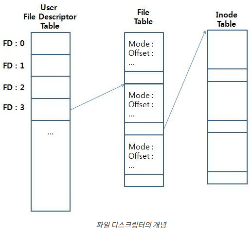
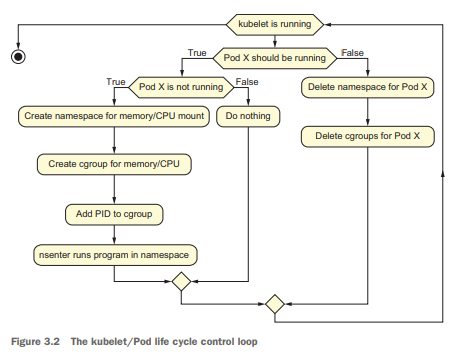
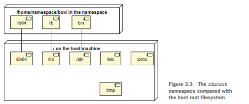

# 3장: 파드 생성하기

## 리눅스 기본 요소

리눅스를 구성하는 **커널, 기본 프로그램 등의 프로그램**들을 의미합니다.

컨테이너 시스템을 포함해서, 쿠버네티스 생태계의 플러그인이나 애드온들이 이 **기본 요소를 기반으로 제작**됩니다. 예를 들면...

 - `kube-proxy`: iptables 규칙을 생성, 네트워크 문제를 찾기 위해 규칙 검사 등을 수행
 - `Container Storage Interface`: kubelet과 스토리지 구현 사이의 통신을 위한 소켓을 정의
 - `Container Runtime`: unshare, mount 등을 사용해서 격리된 프로세스를 구성하는 명령을 실행

> ### iptables?
> 
> **리눅스 커널 방화벽**. 패킷 규칙 테이블을 구성하고, 저장하는 체인 등을 제공합니다.

> ### Container Storage Interface?
> 
> **컨테이너의 스토리지 관리를 위한 인터페이스**입니다. 쿠버네티스는 다양한 종류의 스토리지를 지원하는데요.
> `emptyDir`, `awsElasticBlockStore`, `cephfs` 등... 이런 다양한 스토리지를 지원하기 위해서,
> 스토리지를 CSI라는 인터페이스로 추상화합니다.

> ### Container Runtime Interface?
> 
> **kubelet이 다양한 컨테이너 런타임을 사용할 수 있도록 추상화한 인터페이스**입니다.
> 사용할 수 있는 컨테이너 런타임으로는 `docker`, `containerd`, `cri-o`등이 있습니다. CRI는 컨테이너 런타임과 kubelet이 통신하기 위한
> 프로토콜이라고 볼 수 있습니다. (실제로 gRPC 프로토콜로 통신합니다.)

### Namespace

하나의 시스템(리눅스)에서 **프로세스를 격리시킬 수 있는 가상화 기술**입니다. 

같은 namespace끼리만 영향을 주고받는다고 생각하면 됩니다. 즉 격리된 공간을 만드는 거죠. 

예를 들어 파일 시스템을 격리한다고 해볼게요. 
`Mount Namespace`를 지정하면 파일 시스템을 mount/unmount해도 namespace 밖 시스템에 영향을 주지 않습니다. 오직 namespace 
안에서만 효과 발동!

그 외에도 리눅스에서는 다양한 namespace를 지원하는데요.

 - `mount`: 파일 시스템 mount 격리
 - `UTS`: hostname, domainname 격리
 - `IPC`: IPC 자원(공유 메모리, semaphore, message queue) 격리
 - `network`: 네트워크 자원(IP routing table, firewall rules, sockets, ...) 격리
 - `PID`: process ID 격리
 - `user`: UID, GID 격리

이 기술은 컨테이너들이 모두 독립적으로 동작하게 할 수 있는 기반으로, 컨테이너 시스템의 핵심입니다.

## 리눅스에서 모든 것은 파일이다

리눅스는 다른 운영체제와 달리 저장장치에 있는 파일뿐만 아니라, **시스템 정보, 소켓, 파이프 등... 전부 파일로 관리**합니다.

윈도우즈는 레지스트리를 관리하려면 전용 프로그램을 사용해야합니다. 반면 리눅스는 파일 R/W를 통해 시스템 정보를 관리할 수 있습니다.

심지어 USB 드라이브뿐만 아니라 마우스같은 **디바이스도 파일로 관리**합니다. 이런 디바이스를 연결하면 `/dev`아래에 파일이 생겨요.
바이트 R/W와 관련된 대부분의 것들을 파일로 관리한다고 보면 됩니다.

### File Descriptor

**파일에 접근하기 위해 사용되는 파일 index값**입니다.



리눅스 커널에는 `Open file descriptor table`이 있습니다. 
파일을 생성하면 이 테이블에 `파일 참조`를 포함해서 `제어 플래그`, `접근 모드` 등을 담고있는 엔트리를 하나 생성합니다.

이 엔트리의 index 값이 FD입니다. 즉 FD를 사용해서 Open file descriptor table에 접근해 파일 참조에 관한 정보들을 가져올 수 있는 것입니다.
참고로 `STDIN`, `STDOUT`, `STDERR` 표준 입출력들은 FD가 0, 1, 2로 지정되어있습니다.

### 명령 Pipe

리눅스에서는 명령의 결과를, 파이프(|)로 연결해 **다음 명령으로 전달**할 수 있습니다.
예를 들어 쿠버네티스의 `etcd` 컨테이너가 잘 실행되고있는지 확인하고 싶다면?

```bash
ls /var/log/containers | grep etcd
```

위의 명령처럼 먼저 container 목록을 ls로 조회하고, `etcd`가 포함된 부분을 출력할 수 있습니다.

## 쿠버네티스에서 리눅스 기본 요소를 어떻게 사용할까

쿠버네티스는 파드를 생성할 때 격리, 네트워킹, 프로세스 관리 등을 수행합니다. 마술처럼 완전 새로운 기술을 통해서 구현된 게 아닙니다.
그저 리눅스에서 제공하는 유틸리티들을 활용할 뿐입니다.

쿠버네티스가 사용하는 몇 가지 리눅스 기본 요소를 나열하면...

 - `swapoff`: 메모리 스와핑을 비활성화하기 위해 사용합니다.
 - `iptables`: 파드의 iptables rule을 생성합니다.
 - `mount`: 특정 위치에 리소스를 연결합니다.
 - `systemd`: `kubelet`을 실행합니다.
 - `socat`: 다목적 데이터 릴레이 프로그램으로, `kubectl portforward`에 사용됩니다.
 - `nsenter`: 다른 네임스페이스에서 프로그램을 실행시킬 수 있습니다. 다른 네임스페이스의 상태를 확인할 때 사용합니다.
 - `unshare`: PID, 네트워크, 마운트 등 네임스페이스를 격리시켜 프로세스를 실행합니다. 파드를 격리할 때 사용합니다.
 - `ps`: `kubelet`이 프로세스를 모니터링할 때 사용합니다. 좀비 프로세스나 프로세스 권한 등을 확인합니다.

## kubelet이 파드를 관리하는 방법



kubelet은 위의 플로우대로 파드를 모니터링하고 관리합니다.

간단하게 요약하면
 - **파드가 죽으면**: <u>다시 살린다.</u> 네임스페이스 만들고, cgroup만들고, PID 추가하고, ...
 - **파드가 임의로 중단되면**: <u>삭제한다.</u> 네임스페이스 삭제하고, cgroup 삭제하고

여기서는 파드에 대한 플로우만 살펴보았지만, 결국 쿠버네티스는 이런 제어 루프들의 거대한 집합이라고 볼 수 있습니다.

그리고 여기서 **프로세스 관리 측면에서**의 VM과 쿠버네티스의 차이점이 드러나는데요.

먼저 VM을 생성, 관리하는 **하이퍼바이저**는 VM이 어떤 프로세스를 실행중인지 모릅니다. 그저 하드웨어를 시뮬레이션해 줄 뿐이에요.

그에 비해 **kubelet**은 프로세스(파드)를 관리하고, 모니터링하고, 시작/종료 할 수 있습니다. 하이퍼바이저와 달리 프로세스를 더 능동적으로 관리한다고 볼 수 있죠.

> ### 쿠버네티스와 도커는 무슨 관계인가?
> 쿠버네티스는 컨테이너를 관리하기위해 컨테이너 런타임을 사용합니다.
> 
> 도커는 그런 컨테이너 런타임 구현중 하나입니다. 다만 docker가 CRI를 준수하지 않아서 1.20버전부터 도커 지원이 안된다고 하네요.
> 대신 다른 유명한 CRI 구현인 containerd를 사용할 수 있습니다. 참고로 도커도 내부적으로 이 containerd를 사용합니다.

## kubelet이 파드를 생성하는 방법

쿠버네티스는 파드를 생성하기 전에, 어떤 노드에 생성할지 스케줄러를 통해 결정합니다. 이 스케줄러는 CPU, 메모리, 스토리지 가용성 등을 기반으로 최적의 노드를 찾아냅니다.

또한 파드를 실행할 때 PID가 필요한데, 파드를 재시작하면 PID가 변경되므로 재시작할때 이를 추적/관리해야합니다.

여기서는 쉬운 예제를 위해 아직 파드의 스케줄링, 배포, 재시작에 관한건 다루지 않습니다.

### 1. chroot로 디렉터리 격리된 프로세스 생성

chroot를 사용해서 프로세스가 파일 시스템 상으로 격리되도록 할 수 있습니다.



`/home/namespace/box`폴더를 만들고, 여기에 컨테이너 환경을 구성한다고 가정할게요. 우리는 chroot를 사용해서 `/home/namespace/box`가 루트 디렉터리인 bash를 띄울 수 
있습니다.

```bash
chroot /home/namespace/box /bin/bash

-> chroot: failed to run command '/bin/bash': No such file or directory
```

그런데! 이 명령을 실행하면 오류가 발생해요. **왜냐하면 새롭게 `/home/namespace/box`가 루트 디렉터리가 되었는데,
`/bin/bash`가 없기 때문에 발생한 오류**입니다. 즉 `/home/namespace/box/bin/bash`가 없기 때문이에요.

그래서 /bin/bash를 비롯해, bash를 실행하기 위한 모든 라이브러리들을 새로운 루트 디렉터리에 미리 준비해주어야합니다.

```bash
mkdir /home/namespace/box
mkdir /home/namespace/box/bin
mkdir /home/namespace/box/lib
mkdir /home/namespace/box/lib64

# bash를 복사한다.
cp -v /usr/bin/bash /home/namespace/box/bin

# bash를 사용하기 위한 종속성들을 복사한다.
# 여기서는 전부 복사하는데, 좀 더 compact하게 복사하고 싶으면 ldd명령어를 활용할 수 있다.
cp -r /lib/* /home/namespace/box/lib
cp -r /lib64/* /home/namespace/box/lib64

# box폴더로 디렉터리 격리해서 bash실행
chroot /home/namespace/box /bin/bash
```

이렇게 bash와 관련 종속성들을 모두 복사해주면 됩니다. ps나 ls같은 명령어를 사용하고 싶다면 bash와 마찬가지로 복사해주어야 합니다.

> ### chroot가 왜 디렉터리 격리에 사용되는가?
> 
> 루트 디렉터리를 바꾸고나면, **그 상위 폴더에는 접근할 수 없기 때문**입니다. 예시로 `/home/namespace/box`를 루트 디렉터리로 지정하면
> 이 폴더 상위에 있는 /bin/bash나 /home/namespace등에 접근할 수 없습니다. 즉, 격리되었다고 볼 수 있죠.

### 2. mount로 작업 데이터 제공

컨테이너가 외부 스토리지(클라우드, 호스트 등)에 엑세스하기 위해서, 스토리지를 컨테이너 내 디렉터리에 마운트해야합니다.

디바이스(디스크 등)가 아니라, 호스트 디렉터리에 마운트하려면 --bind 옵션을 사용하면 됩니다.

```bash
mount --bind /tmp /home/namespace/box/data
```

`mount`의 --bind옵션은 링크를 걸어준다고 생각하면 됩니다. `/home/namespace/box/data`에 접근하면 마치 `/tmp`에 접근한 것 처럼 동작합니다.
파일 추가, 삭제, 읽기 모두 가능합니다. (권한만 있다면) 

컨테이너와 호스트 시스템 사이의 공유 폴더라고 생각할 수 있겠네요. 그래서 보안 문제가 발생할 수 있으므로 주의해야합니다.

여기서는 직접 mount를 사용해서 스토리지와 연결했습니다. 만약 수많은 파드가 사용하고있던 스토리지의 mount를 변경해야한다면, 모든 파드에 대해 mount를 다시 수행해야하죠.

쿠버네티스에서 제공하는 PV와 PVC는 이러한 스토리지 시스템을 추상화해서 제공합니다.
 - 스토리지가 변경되면 mount를 자동으로 수행합니다.
 - 스토리지 사용 제한도 설정할 수 있습니다.
 - 스토리지 볼륨에 연결 실패할 경우 보고하게 할 수 있습니다.

### 3. unshare로 프로세스 격리

파일 시스템까지는 격리했지만, 프로세스는 격리하지 않았습니다. 그래서 컨테이너에서 호스트의 중요 프로세스를 임의로 `kill`할 수 있습니다!

컨테이너가 **호스트의 프로세스에 접근할 수 없도록 격리**해야합니다. 안 그러면 컨테이너에서 kubelet을 kill하거나 시스템 파일을 삭제할 수도 있어요.

unshare명령을 사용해서 호스트와 프로세스 격리된 프로세스(예제에서는 bash)를 띄울 수 있습니다.

```bash
# -p는 PID namespace로 격리하는 옵션
# -f는 unshare의 child process로 실행하는 옵션
# --mount-proc은 proc폴더를 다른 마운트 네임스페이스로 격리하는 옵션
unshare -p -f --mount-proc=/home/namespace/box/proc chroot /home/namespace/box /bin/bash
```


참고로 PID namespace 격리는 **실행할 특정 프로세스를 init 프로세스(PID가 1인)로 인식하도록 격리**하는 것입니다.

그런데 ps나 pstree같은 명령은 `/proc`을 읽어서 프로세스 목록을 보여줍니다. PID Namespace 격리만으로는 호스트 프로세스를 읽지 못하도록 할 수 없습니다.
즉, 컨테이너에서 ps명령을 사용했을 때 호스트 프로세스가 그대로 노출됩니다. 

그래서 --mount-proc을 지정해서 `/proc`를 다른 마운트 네임스페이스로 격리시켜주어야합니다.

### 4. 네트워크 네임스페이스 격리

이어서 네트워크 환경도 호스트와 격리해야합니다. 마찬가지로 unshare를 사용하면 됩니다.

```bash
# -n 옵션이 추가되어 네트워크도 격리된다.
unshare -n -p -f --mount-proc=...
```

이 방법으로 네트워크를 격리하면, 외부와 통신할 수 없습니다. 네임스페이스를 생성하면서 라우팅과 IP정보도 초기화되었기 때문입니다.

여기서는 복잡해서 해보진않겠지만, 가상 네트워크 인터페이스와 브릿지를 두어 파드 네트워크를 구성합니다. ([참고](https://coffeewhale.com/k8s/network/2019/04/19/k8s-network-01/))

그런데 파드는 종종 재시작되거나 추가/삭제됩니다. 그래서 매번 IP주소가 바뀔 수 있는데요. 외부에서 파드에 접근할 때 매번 IP주소를 알아야하니 불편할 것 같아요.

쿠버네티스에서 제공하는 **서비스**는 이런 문제를 해결합니다.
 - 서비스는 고정된 IP를 가지고 있습니다.
 - 이 서비스를 통해 접근하면 특정 파드로 프록시해줍니다.
   - 심지어 파드가 여러 개여도 **로드벨런싱**해서 프록시해줍니다!
   - 레이블을 통해 파드를 지정하는데, 직관적으로 설계되어 사용하기 쉽습니다.

서비스에서 네트워크를 구성하는 방법은 `kube-proxy`를 이용하는 것입니다.
네트워크 요청을 `kube-proxy`로 보내고, `kube-proxy`가 로드벨런싱해서 적절한 서버에 전달합니다. ([참고](https://coffeewhale.com/k8s/network/2019/05/11/k8s-network-02/))

이 과정을 수행하기 위해 `kube-proxy`는 `netfilter`와 `iptables`를 활용합니다. 우선 `kube-proxy`에는 다양한 모드가 있습니다. 
 - **userspace mode (older)**: `iptables`를 사용해 패킷을 `kube-proxy`로 보내고, 적절한 서버로 전달하는 방식입니다.
 - **iptables mode (default)**: `iptables`와 `netfilter`에 라우팅 규칙을 추가해서, `netfilter`가 프록싱을 수행하는 방식입니다.
 - **ipvs mode**: 리눅스 커널의 L4 LB인 `IPVS`를 사용해서 라우팅합니다.

> ### 왜 kube-proxy가 아닌 netfilter가 프록싱을 수행하도록 설계했을까? (왜 iptables mode가 default인가?)
> 
> 성능 문제때문입니다. `kube-proxy`는 user space mode에서 실행되지만, `netfilter`는 kernel space mode에서 프록싱을 수행합니다.
> 모든 패킷은 결국 처음에 kernel 레벨에서 받으므로, `kube-proxy`가 프록싱을 수행하려면 user <-> kernel 사이의 변환이 필요합니다.
> 그래서 userspace mode로 설정하면 성능에 영향을 줄 수 있습니다.
> 
> 반면 iptables mode는 netfilter가 프록싱을 수행하므로, 온전히 kernel space에서 동작합니다. 별도의 user, kernel 모드로 변환이 없어서 더 빠릅니다.

### 5. cgroup으로 CPU 조정

cgroup은 **시스템 리소스(CPU, Memory, 등...)을 제한**하고, **통계를 내주는 기능**을 제공합니다.

cgroup 기능을 수행하는 서브 시스템들이 있는데요. 이 서브 시스템들이 돌면서 리소스 제한, 통계 등의 기능들을 수행합니다.

그리고 재미있는 점은 cgroup 설정을 파일 시스템으로 한다는 점입니다. `/sys/fs/cgroup` 아래에 있는 파일들을 조작해서 cgroup설정을 할 수 있습니다.

예를 들어 CPU 사용 시간 설정을 해볼게요.

 - `/sys/fs/cgroup/cpu`에 원하는 이름의 폴더를 하나 생성하면 자동으로 그 폴더에 설정 파일들이 만들어집니다.
 - 그 설정 파일중 `tasks`에 원하는 PID를 끝에 추가하면, 그 프로세스가 방금 만든 cgroup에 등록됩니다. 
 - 이어서 `cpu.cfs_quota_us`파일을 수정해서 CPU 사용 시간을 제한할 수 있습니다.
